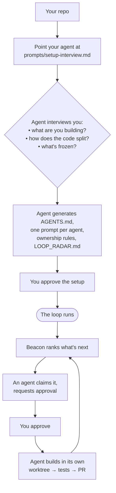

# All-in-One Multi-Agent Loop Kit v0.5.0

> ⚠️ **GENERATED SNAPSHOT — DO NOT EDIT THIS FILE.**
>
> Built by `tools/build-all-in-one.sh` on 2026-06-08 16:40 UTC.
> This is a flattened, read-only concatenation of the kit, provided only
> for quick reading or pasting into a single AI context window.
>
> The **canonical source is the folder structure** (`README.md`,
> `AGENTS.md`, `prompts/`, `tools/`, `docs/`, etc.). Always copy and edit
> those, then re-run the generator. Any change made here will be lost.

Contains 82 files.

---

## `.cursor/rules/00-repo-context.mdc`

```md
---
description: Repo context and read order
alwaysApply: true
---

# Repo context

This repo uses a multi-agent workflow with worktrees, path ownership, journals, proposals, approvals, and a Beacon loop layer.

Read in this order:

1. `AGENTS.md`
2. `OPERATING_GUIDE.md`
3. `PROTOCOL.md`
4. `PROTOCOL.md`
5. `LOOP_RADAR.md`
6. `LOOP_MEMORY.md`
7. your own journal in `agents-status/<codename>.md`
8. relevant task briefs and approvals

Never assume you can edit a file until you check ownership.
```

## `.cursor/rules/01-ownership.mdc`

```md
---
description: Path ownership matrix
alwaysApply: true
---

# Ownership rule

Every coding agent may edit only its owned paths.

If a change requires editing another owner's path, stop and create one of:

- journal task for that owner
- approval request
- proposal
- operator ask

Do not perform drive-by edits in another owner’s path.

---

## Ownership matrix

Replace with repo-specific paths.

| Path | Owner | Notes |
|---|---|---|
| `apps/web/**` | `frontend` | UI |
| `apps/api/**` | `backend` | API/backend |
| `packages/types/**` | `operator` | frozen contracts |
| `packages/mocks/**` | `agentkit` | mock fixtures |
| `.github/**` | `ops` | CI |
| `.cursor/rules/**` | `operator` | persistent rules |
| `agents-status/<codename>.md` | `<codename>` | own journal only |
| `agents-status/proposals/**` | shared protocol | author creates, operator decides |
| `agents-status/approvals/**` | shared protocol | requester creates, operator decides |
```

## `.cursor/rules/02-contracts-frozen.mdc`

```md
---
description: Frozen contract rules
alwaysApply: true
---

# Frozen contracts

Shared contracts/types/schemas are operator-owned.

Default contract paths:

- `packages/types/**`
- `packages/*-types/**`
- `schemas/**`
- `openapi/**`
- `proto/**`

Rules:

1. Coding agents must not edit contracts unless explicitly approved.
2. Contract changes require a proposal.
3. The operator decides contract changes.
4. All consumers must import from the shared contract package.
5. Do not create local workaround types that hide drift.
6. Run typecheck after contract changes.
7. Broadcast contract bumps through journal/proposal/standup.
```

## `.cursor/rules/03-journal-format.mdc`

````md
---
description: Journal format and coordination rules
alwaysApply: true
---

# Journal rules

Each agent maintains:

`agents-status/<codename>.md`

Update it:

- at session start
- before stopping
- when blocked
- after shipping
- after creating approval/proposal
- after accepting/skipping Beacon task

Use exactly this schema:

```md
## Now
## Just shipped
## Blocked / waiting on
## Discussion needed
## Approvals open
## Proposals open
## Next
## Notes
```

Write `nothing` in empty sections.

Never coordinate meaningful build state through private chat. Put it in journals, approvals, proposals, or task briefs.

Use these prefixes:

```txt
[task] <agent>: <action>
[approval] operator: <approval path>
[setup] operator: <setup action>
[launch] operator: <demo/launch action>
```
````

## `.cursor/rules/04-commit-style.mdc`

````md
---
description: Branch, commit, and PR conventions
alwaysApply: true
---

# Commit style

Branch:

```txt
<codename>/<slug>
```

Commit:

```txt
<codename>: <imperative lowercase message>
```

PR title:

```txt
<Codename>: <Title case summary>
```

PR body must include:

- What changed
- Why now
- Owned paths touched
- Approval/proposal link if relevant
- Tests run
- Coordination impact
- Remaining work

Before PR:

```bash
bun typecheck
bun test
```

Adapt commands to the repo’s package manager.
````

## `.cursor/rules/05-loop-listening.mdc`

```md
---
description: Beacon loop listening rules
alwaysApply: true
---

# Loop listening rules

Every coding agent must read:

1. `LOOP_RADAR.md`
2. `agents-status/task-briefs/*.md`
3. `agents-status/approvals/*.md`
4. its own journal

Agents may self-select tasks only when:

1. The task touches only their owned paths.
2. The task aligns with the current build objective.
3. The task has no unresolved contract/schema decision.
4. The task does not conflict with another open PR.
5. The task has operator approval if approval is required.

---

## Agent response protocol

When a task is relevant, do not start coding immediately if approval is required.

First create or update:

`agents-status/approvals/NNN-<agent>-<task>.md`

Then add to your journal:

`[approval] operator: agents-status/approvals/NNN-<agent>-<task>.md`

---

## Safe maintenance exception

Agents may proceed without approval only for:

- updating their own journal
- fixing typos in owned docs
- adding missing test notes
- fixing clearly broken formatting
- running read-only scans

Anything that changes product behavior requires approval.

---

## Beacon is not the operator

Beacon can suggest, rank, and create task briefs.

Beacon cannot approve work.

Only the operator can approve:

- product direction
- schema/contract changes
- new dependencies
- feature cuts
- demo flow changes
- cross-agent tasks
- behavior-changing implementation
```

## `.github/CODEOWNERS.example`

```text
# CODEOWNERS example for Multi-Agent Loop Kit
# Copy this to .github/CODEOWNERS and replace owners with real GitHub handles.

# Project Lead-owned governance files
/AGENTS.md                    @repo-owner
/RUNBOOK.md                   @repo-owner
/MULTI_AGENT_WORKFLOW.md      @repo-owner
/LOOP_SYSTEM.md               @repo-owner
/.cursor/rules/               @repo-owner
/agents-status/proposals/     @repo-owner

# Beacon-owned coordination files, still reviewed by the Project Lead
/LOOP_RADAR.md                @repo-owner
/LOOP_MEMORY.md               @repo-owner
/agents-status/task-briefs/   @repo-owner
/agents-status/approvals/     @repo-owner
/tools/loop/                  @repo-owner

# Example coding-agent ownership
/apps/web/                    @frontend-owner
/apps/api/                    @backend-owner
/packages/agent-kit/          @agentkit-owner
/packages/mocks/              @agentkit-owner
/.github/                     @ops-owner @repo-owner
/infra/                       @ops-owner @repo-owner
/scripts/                     @ops-owner @repo-owner

# Frozen contracts should be reviewed by the Project Lead
/packages/types/              @repo-owner
/packages/contracts/          @repo-owner
```

## `.github/ISSUE_TEMPLATE/bug_report.md`

````md
---
name: Bug report
about: Report something that did not work in your repo setup
title: "bug: "
labels: bug
assignees: ""
---

## What happened?


## What did you expect?


## Repo shape

- [ ] single app
- [ ] full-stack app
- [ ] monorepo
- [ ] library/packages
- [ ] other:

## Setup

AI tool:
OS/shell:
Workspace isolation:
- [ ] git worktrees
- [ ] separate clones
- [ ] dev containers
- [ ] VM
- [ ] hosted agent workspace
- [ ] other:

## Agents used


## Command or prompt used

```bash

```

## Logs / screenshots


````

## `.github/ISSUE_TEMPLATE/docs_improvement.md`

```md
---
name: Docs improvement
about: Suggest clearer setup docs, examples, prompts, or templates
title: "docs: "
labels: documentation
assignees: ""
---

## Which doc/template?


## What was confusing or missing?


## Suggested improvement


```

## `.github/pull_request_template.md`

````md
## What changed

-

## Why now

-

## Agent / ownership

Agent: `<codename>`  
Branch: `<codename>/<slug>`

Owned paths touched:

-

## Approval / proposal

Link one if relevant:

- Approval: `agents-status/approvals/...`
- Proposal: `agents-status/proposals/...`

Project Lead decision summary:

-

## Tests run

```bash
# paste commands here
```

## Journal / loop updates

- [ ] `agents-status/<codename>.md` updated
- [ ] task brief updated if relevant
- [ ] approval/proposal status updated if relevant
- [ ] Beacon/radar update needed? yes/no

## Coordination impact

- [ ] No cross-agent path changes
- [ ] No frozen contract changes
- [ ] No new dependencies
- [ ] No data/auth/security-sensitive changes
- [ ] No pending approval/proposal is being bypassed

If any box above is unchecked, explain:

-

## Screenshots / demo notes

-
````

## `.github/workflows/pr-validation.yml`

```yaml
name: PR validation

# Minimal validation for the Multi-Agent Loop Kit conventions.
#
# What this enforces automatically (hard gate):
#   - branch name follows  <codename>/<slug>
#   - every commit subject follows  <codename>: <message>
#   - PR body includes the required coordination sections
#
# What it assists with (not a hard gate):
#   - lists the files this PR changed, so a human reviewer can check them
#     against the ownership table in AGENTS.md.
#
# Path-ownership is intentionally NOT auto-enforced here. AGENTS.md is the
# single source of truth for ownership; parsing it into a second machine
# format would create drift. If your team wants hard ownership enforcement,
# add a machine-readable ownership map and extend the "ownership-review" job.

on:
  pull_request:
    types: [opened, edited, synchronize, reopened]

permissions:
  contents: read
  pull-requests: read

jobs:
  conventions:
    name: Branch, commit, and PR-body conventions
    runs-on: ubuntu-latest
    steps:
      - name: Check out PR
        uses: actions/checkout@v4
        with:
          fetch-depth: 0

      - name: Validate branch name
        run: |
          branch="${{ github.head_ref }}"
          echo "Branch: $branch"
          # Allow the operator working directly on main.
          if [ "$branch" = "main" ] || [ "$branch" = "master" ]; then
            echo "Operator branch, skipping codename check."
            exit 0
          fi
          if echo "$branch" | grep -Eq '^[a-z][a-z0-9]*/[a-z0-9._/-]+$'; then
            echo "✅ Branch follows <codename>/<slug>."
          else
            echo "::error::Branch '$branch' must follow <codename>/<slug>, e.g. frontend/demo-intent-capture."
            exit 1
          fi

      - name: Validate commit message prefixes
        run: |
          base="${{ github.event.pull_request.base.sha }}"
          head="${{ github.event.pull_request.head.sha }}"
          # Allowed prefixes: agent codenames use lowercase letters/digits.
          # Generic prefixes below let external contributors land docs/chores
          # without inventing a codename. Add your own codenames as needed.
          generic='^(docs|chore|ci|example|test|build|fix|refactor): .+'
          codename='^[a-z][a-z0-9]*: .+'
          fail=0
          while IFS= read -r subject; do
            # Skip merge commits.
            case "$subject" in
              "Merge "*) continue ;;
            esac
            if echo "$subject" | grep -Eq "$generic" || echo "$subject" | grep -Eq "$codename"; then
              echo "✅ $subject"
            else
              echo "::error::Commit subject must follow '<prefix>: <message>'."
              echo "::error::Use an agent codename (frontend:, backend:, ...) or a"
              echo "::error::generic prefix (docs:, chore:, ci:, fix:, ...). Offending: $subject"
              fail=1
            fi
          done < <(git log --no-merges --format='%s' "$base".."$head")
          exit $fail

      - name: Validate PR body has coordination sections
        env:
          PR_BODY: ${{ github.event.pull_request.body }}
        run: |
          missing=0
          require() {
            if echo "$PR_BODY" | grep -iq "$1"; then
              echo "✅ found: $1"
            else
              echo "::error::PR body is missing a required section mentioning: $1"
              missing=1
            fi
          }
          # These mirror .github/pull_request_template.md.
          require "owned paths"
          require "tests"
          require "coordination"
          if [ "$missing" -ne 0 ]; then
            echo "Use .github/pull_request_template.md as the PR body."
            exit 1
          fi

  ownership-review:
    name: Changed files for ownership review (advisory)
    runs-on: ubuntu-latest
    steps:
      - name: Check out PR
        uses: actions/checkout@v4
        with:
          fetch-depth: 0

      - name: List changed files for human review
        run: |
          base="${{ github.event.pull_request.base.sha }}"
          head="${{ github.event.pull_request.head.sha }}"
          {
            echo "## Files changed by this PR"
            echo ""
            echo "Reviewer: confirm every file below is inside the agent's owned"
            echo "paths in AGENTS.md, or that the PR links an approval/proposal."
            echo ""
            echo '```'
            git diff --name-only "$base" "$head"
            echo '```'
          } >> "$GITHUB_STEP_SUMMARY"
```

## `.gitignore`

```gitignore
# dependencies
node_modules/

# logs
*.log

# env
.env
.env.*
!.env.example

# OS/editor
.DS_Store
.vscode/
.idea/

# build outputs
dist/
build/
coverage/

# optional local work
.local/
```

## `AGENTS.md`

````md
# AGENTS.md — Multi-Agent Ownership Registry

> **Setting this kit up in this repo?** If you are an AI agent helping configure
> the kit, read `prompts/setup-interview.md` first — it tells you how to
> interview the user and fill this file in for their project. The contents below
> are a generic template until that interview is done.

This file is the source of truth for who can edit what.

Every coding agent must obey path ownership, journal updates, proposal rules, approval gates, and PR discipline.

---

## Two meanings of “agent”

| Term | Meaning |
|---|---|
| **Coding agent** | A Cursor / Claude / Codex session with a codename, worktree, owned paths, branch prefix, and kickoff prompt |
| **Runtime agent** | An app-level process in your product, e.g. an agent that subscribes to events, calls APIs, or executes user workflows |

This file is about **coding agents**.

---

## Core rules

1. One coding agent per worktree.
2. One worktree per Cursor / Claude / Codex window.
3. Every path has exactly one owner.
4. No coding agent commits outside owned paths.
5. Cross-boundary changes require a proposal or approval request.
6. Shared contracts are frozen and operator-owned.
7. Agents coordinate through journals, task briefs, approvals, and proposals.
8. Agents never coordinate through private chat if the information affects build state.
9. All implementation work happens on `<codename>/<slug>` branches.
10. All meaningful work ends with tests, journal update, and PR.

---

## Project Lead / Operator

| Field | Value |
|---|---|
| Codename | `operator` |
| Human | Project Lead / repo owner |
| Owns | Product decisions, contracts, specs, runbook, rules, final approval |
| Branch | `main` unless intentionally editing |
| Commit prefix | `operator:` |

Project Lead / operator owns:

- `AGENTS.md`
- `OPERATING_GUIDE.md`
- `PROTOCOL.md`
- `RUNBOOK.md`
- `LOOP_RADAR.md` final objective
- `LOOP_MEMORY.md` final decisions
- shared contracts/types/schemas
- `.cursor/rules/**`
- `agents-status/proposals/**` decisions
- `agents-status/approvals/**` decisions

The Project Lead / operator is the only approval authority for:

- Product direction
- Schema / contract changes
- New dependencies
- Architecture shifts
- Cross-agent tasks
- Feature cuts
- Demo flow changes
- Risky refactors

---

## Beacon — loop intelligence agent

| Field | Value |
|---|---|
| Codename | `beacon` |
| Role | Loop radar, build-factor updates, task briefs, approval queue |
| Owns | Loop docs and coordination files |
| Branch prefix | `beacon/<slug>` |
| Commit prefix | `beacon:` |

Beacon owns:

- `LOOP_RADAR.md`
- `LOOP_MEMORY.md`
- `agents-status/beacon.md`
- `agents-status/task-briefs/**`
- `agents-status/approvals/**` creation only, not decisions
- `tools/loop/**`

Beacon does not code product features.

Beacon must never directly edit:

- `apps/**`
- `packages/**`
- product code
- shared contracts
- migration files
- security-sensitive code

Beacon can:

- Read repo state.
- Read journals.
- Read proposals.
- Read approvals.
- Read open PR summaries if available.
- Create or update task briefs.
- Create approval requests.
- Rank build factors in `LOOP_RADAR.md`.
- Update `agents-status/beacon.md`.

Beacon cannot:

- Approve work.
- Merge work.
- Change contracts.
- Assign work as binding.
- Override ownership.

---

## Coding agents

Replace these examples with your repo’s actual agents.

| Codename | Owns | Role | Branch prefix | Commit prefix |
|---|---|---|---|---|
| `frontend` | `apps/web/**`, `components/**` | Web UI | `frontend/<slug>` | `frontend:` |
| `backend` | `apps/api/**`, `server/**` | API/backend | `backend/<slug>` | `backend:` |
| `agentkit` | `packages/agent-kit/**`, `packages/mocks/**` | Agent SDK/mocks | `agentkit/<slug>` | `agentkit:` |
| `ops` | `.github/**`, `infra/**`, `scripts/**` | CI/devops | `ops/<slug>` | `ops:` |

---

## Ownership matrix

Every repo must fill this table before parallel work starts.

| Path | Owner | Notes |
|---|---|---|
| `apps/web/**` | `frontend` | UI only |
| `apps/api/**` | `backend` | API only |
| `packages/types/**` | `operator` | Frozen contract package |
| `packages/mocks/**` | `agentkit` | Mocks for all agents |
| `.github/**` | `ops` | CI workflows |
| `.cursor/rules/**` | `operator` | Persistent agent memory |
| `agents-status/**` | shared by protocol | Each agent edits only its own journal; approvals/proposals follow rules |

---

## Cross-boundary rule

If an agent needs a change outside owned paths, it must choose one:

1. Create a task for the owning agent in its journal.
2. Create an approval request if the change is known and bounded.
3. Create a proposal if the change is architectural, product-level, or contract-level.
4. Ask the operator if ownership is unclear.

Agents must not “just quickly edit” another owner’s file.

---

## Journal rule

Each agent has:

```txt
agents-status/<codename>.md
```

Every journal must use the fixed schema from `agents-status/JOURNAL_TEMPLATE.md`.

Agents update journals:

- session start
- before stopping
- when blocked
- after shipping
- when creating approval/proposal
- when taking or rejecting a Beacon task

---

## Proposal vs approval

Use **proposal** when the operator must decide direction.

Examples:

- Schema change
- Stack change
- Feature cut
- Product behavior change
- New dependency
- Security model
- Major refactor

Use **approval request** when work is already understood but needs permission.

Examples:

- “Build demo replay in cockpit”
- “Add scoped mock fixtures”
- “Refactor this owned module”
- “Wire UI to existing endpoint”

---

## Branch and PR rules

- Branch: `<codename>/<slug>`
- Commit: `<codename>: <imperative message>`
- PR title: `<Codename>: <Title>`
- Never push directly to `main` unless you are the operator and intentionally doing a solo merge.
- PR body must include:
  - What changed
  - Why now
  - Owned paths touched
  - Tests run
  - Coordination impact
  - Approval/proposal link if relevant

---

## Adding a new agent

Add a new agent only when:

1. The new owned path set is disjoint.
2. A kickoff prompt exists.
3. A journal exists.
4. Cursor ownership rules are updated.
5. Worktree spawn script supports the codename.
6. Operator approves the new agent.

If two agents would edit the same directory, split the directory first or merge the roles.
````

## `BLOCKERS.md`

```md
# BLOCKERS

Generated: 2026-06-08 13:26:32

```

## `CHANGELOG.md`

```md
# Changelog

## v0.5.0 — first public release

A file-based operating model for running parallel AI coding agents in a
continuous, human-approved loop.

- **Protocol** — path ownership, git worktrees, file-based coordination, frozen
  contracts, and the authority split (Beacon suggests, agents build, you approve).
- **Operating guide + runbook** — how to break work into agents, write each
  agent's prompt, run the loop, and what to do when things deviate.
- **Status board** (`bun run status`) — every agent's state at a glance.
- **Agent-driven setup** — point your agent at `prompts/setup-interview.md`; it
  interviews you and configures the kit for your repo.
- **Safe installer** for existing repos (never overwrites your files) and a
  GitHub-template path for new repos.
- **Three modes** — Setup mode (agent configures the repo), Loop mode (Beacon
  proposes, you approve, agents build), and Safe auto-mode (approved agents work
  owned slices until a stop condition). See `docs/AUTO_MODE.md`. Not unattended
  autonomy.
- **Two worked examples** — a generic web + api + shared-types repo, and a richer
  5-agent product with a full worked loop iteration.

Releases are tracked on the GitHub Releases page from here on.
```

## `CONTRIBUTING.md`

````md
# Contributing

Thanks for improving Multi-Agent Loop Kit.

This project is intentionally markdown-first and practical. The goal is not to claim full autonomy. The goal is to make human-supervised parallel AI coding work safer and easier to coordinate.

## Good contributions

- clearer onboarding docs
- examples for different repo shapes
- better prompts and templates
- safer shell scripts
- path ownership checks
- GitHub Actions for PR validation
- GitHub Issues / Projects / Linear / Notion integration examples
- Cursor / Claude Code / Codex / Windsurf usage notes
- real-world pressure tests

## Please avoid

- marketing the kit as a fully autonomous software factory
- removing human approval gates without replacing them with a clear safety model
- making scripts destructive by default
- assuming every repo uses Bun, TypeScript, or a monorepo

## Reporting issues

If the kit does not work for your repo, please open an issue with:

- repo shape
- number of agents
- AI coding tool used
- OS and shell
- whether you used worktrees, clones, containers, VMs, or hosted workspaces
- command run
- expected result
- actual result
- relevant logs/screenshots

## Pull requests

Use the PR template. Keep changes small and explain the coordination impact.

### Commit message prefixes

CI checks that every commit subject starts with a prefix. You don't need to
invent an agent codename for ordinary contributions — use a generic prefix:

```txt
docs: fix README typo
chore: update dependency
ci: tweak PR validation
example: add a new repo-shape example
fix: correct spawn-agent base branch detection
```

Agent codenames (`frontend:`, `backend:`, `beacon:`, ...) are for work done
inside a configured multi-agent repo. Both styles pass CI. Branch names follow
`<prefix>/<slug>` (e.g. `docs/fix-readme` or `frontend/demo-intent-capture`).
````

## `LICENSE`

```text
MIT License

Copyright (c) 2026 Multi-Agent Loop Kit contributors

Permission is hereby granted, free of charge, to any person obtaining a copy
of this software and associated documentation files (the "Software"), to deal
in the Software without restriction, including without limitation the rights
to use, copy, modify, merge, publish, distribute, sublicense, and/or sell
copies of the Software, and to permit persons to whom the Software is
furnished to do so, subject to the following conditions:

The above copyright notice and this permission notice shall be included in all
copies or substantial portions of the Software.

THE SOFTWARE IS PROVIDED "AS IS", WITHOUT WARRANTY OF ANY KIND, EXPRESS OR
IMPLIED, INCLUDING BUT NOT LIMITED TO THE WARRANTIES OF MERCHANTABILITY,
FITNESS FOR A PARTICULAR PURPOSE AND NONINFRINGEMENT. IN NO EVENT SHALL THE
AUTHORS OR COPYRIGHT HOLDERS BE LIABLE FOR ANY CLAIM, DAMAGES OR OTHER
LIABILITY, WHETHER IN AN ACTION OF CONTRACT, TORT OR OTHERWISE, ARISING FROM,
OUT OF OR IN CONNECTION WITH THE SOFTWARE OR THE USE OR OTHER DEALINGS IN THE
SOFTWARE.
```

## `LOOP_MEMORY.md`

```md
# LOOP_MEMORY.md

Long-lived memory for Beacon and the operator.

Use this for decisions, stable constraints, and learnings that should influence future loops.

---

## Current product thesis

Write the product thesis here.

---

## Current demo story

Write the demo story here.

---

## Operator decisions

| Date | Decision | Reason | Link |
|---|---|---|---|
| YYYY-MM-DD | Example decision | Why | `agents-status/proposals/000-example.md` |

---

## Architecture constraints

- Shared contracts are operator-owned.
- Agents must not edit outside owned paths.
- Mocks-first is preferred for parallel development.
- Approval required for behavior-changing work.

---

## Agent learnings

| Agent | Learning | Date |
|---|---|---|
| frontend | Example | YYYY-MM-DD |

---

## Repeated blockers

| Blocker | Seen in | Resolution |
|---|---|---|
| Example | frontend/backend | Add fixture |

---

## Superseded assumptions

Do not delete old assumptions silently. Move them here.

| Assumption | Superseded by | Date |
|---|---|---|
| Example | New decision | YYYY-MM-DD |
```

## `LOOP_RADAR.md`

```md
# LOOP_RADAR.md

Last updated: YYYY-MM-DD HH:mm
Updated by: Beacon

---

## Current build objective

Replace this with the repo’s current objective.

Example:

> Ship the smallest investor-demo-ready local flow where user intent enters one surface, gets normalized by the system, triggers at least one subscribed agent, and is visible in a dashboard or log.

---

## Operator constraints

- Keep product decisions approval-gated.
- Keep contracts frozen unless proposal is approved.
- Keep agents inside owned paths.
- Prefer mocks-first progress.
- Prefer demo coherence over overbuilding.
- Do not let agents implement vague tasks.

---

## Top build factors

### 1. Demo coherence

Status: 🟡 needs work

Why it matters:

The product should feel like one connected system, not disconnected features.

Evidence:

- Add evidence from journals, PRs, code, or standup.

Suggested next tasks:

- Create canonical demo scenario fixture.
- Create an end-to-end demo script.
- Make dashboard/cockpit able to replay the scenario.

Likely owners:

- `<agent>`
- `<agent>`

Approval needed: yes

---

### 2. Contract stability

Status: 🟢 / 🟡 / 🔴

Why it matters:

Shared types/schemas unblock or block every other agent.

Evidence:

- Add contract status.

Suggested next tasks:

- Audit consumers.
- Add compatibility checklist.
- Create proposal for required schema changes.

Likely owners:

- operator
- `<contract-owner>`

Approval needed: yes

---

### 3. Blocked agents

Status: 🟢 / 🟡 / 🔴

Why it matters:

Blocked agents waste context windows and token budgets.

Evidence:

- Add blocked journal links.

Suggested next tasks:

- Unblock by owner.
- Create task brief.
- Ask operator for decision.

Likely owners:

- Beacon
- operator

Approval needed: depends

---

## Open task briefs

| Task brief | Priority | Suggested owner | Status |
|---|---|---|---|
| `agents-status/task-briefs/001-example.md` | P1 | frontend | OPEN |

---

## Open approval requests

| Approval | Requested by | Status | Operator action |
|---|---|---|---|
| `agents-status/approvals/001-example.md` | frontend | PENDING | approve/reject/edit |

---

## Beacon notes

- Keep this file short and ranked.
- Move stale detail to `LOOP_MEMORY.md`.
- Do not create more than 3 new P0/P1 task briefs in one loop.
```

## `OPERATING_GUIDE.md`

````md
# Operating Guide

How a human and AI agents run a repo as a multi-agent loop — step by step. This
is the core of the kit. Installing files is a footnote; *this* is the method.

The whole system rests on one split of authority:

```txt
Beacon suggests.  Agents interpret.  Project Lead approves.  Agents build.  Standup verifies.
```

- **Project Lead** — the human. Owns direction, ownership boundaries, frozen
  contracts, and every approval. The only one who can say "yes, build this."
- **Beacon** — a non-coding agent that watches the repo and ranks what matters
  next. Suggests; never approves, never writes product code.
- **Coding agents** — each owns a disjoint set of paths, works in its own git
  worktree, and only builds what's approved.

---

## Step 1 — Break the work into agents (human + agent, together)

This is a conversation, not a config file you fill in alone. Point your coding
agent at `prompts/setup-interview.md` and work through it together. The goal is
to answer four questions:

1. **What are we building?** One concrete objective → `LOOP_RADAR.md`.
2. **How does the code partition?** List the repo's real top-level surfaces
   (`apps/web`, `apps/api`, `packages/*`, services). Each becomes a candidate
   agent. The rule: **every path has exactly one owner, and owners don't
   overlap.** If two agents would touch the same directory, split it or merge the
   agents.
3. **What's frozen?** Which types/schemas/contracts must not change without a
   decision → `.cursor/rules/02-contracts-frozen.mdc`.
4. **How many agents?** 1, 3, 5? More agents = more coordination cost. If the
   work doesn't cleanly partition, use fewer agents (or one) until it does.

The agent should *propose* the split by reading your repo; you decide it. Write
the result into `AGENTS.md` (the ownership table) and
`.cursor/rules/01-ownership.mdc`.

> Task breakdown lives at two levels: **structural** (which agent owns which
> paths — done once, here) and **per-cycle** (what each agent does next — done
> continuously by Beacon in Step 3). Don't confuse them. This step sets the
> boundaries; Beacon fills them with work later.

---

## Step 2 — Give each agent its prompt

Each coding agent is just an AI session that has been told who it is. Create one
prompt per agent from the template:

```bash
cp prompts/coding-agent.md prompts/frontend.md
cp prompts/coding-agent.md prompts/backend.md
```

In each, fill the identity block: codename, role, **owned paths**, branch prefix
(`<codename>/<slug>`), commit prefix (`<codename>:`). That prompt is the agent's
whole contract — it tells the agent what it may touch, what to read at session
start, when to stop and ask for approval, and what "done" means.

Then create one journal per agent so it has somewhere to report state:

```bash
cp agents-status/JOURNAL_TEMPLATE.md agents-status/frontend.md
```

And one isolated workspace per agent:

```bash
bun run spawn frontend day-1   # → ../<repo>-frontend on branch frontend/day-1
```

One agent, one prompt, one journal, one worktree, one AI window. That isolation
is what lets them run in parallel without colliding.

---

## Step 3 — Run the loop

### Attaching Beacon

Beacon is not a daemon and not a background service. **It is an AI session you
open in your main workspace with the Beacon prompt loaded.** That's the whole
"attachment":

```txt
Read prompts/beacon.md and follow it exactly.
```

Beacon then reads the repo, journals, and open PRs and writes `LOOP_RADAR.md`
(ranked "what matters next") plus task briefs in `agents-status/task-briefs/`. It
does not approve and does not write product code.

**How often to run it — the cadence.** Run Beacon at *loop boundaries*, not
continuously:

- at the start of a working session, to set the day's radar;
- after a batch of PRs merges (the repo state changed, so the ranking should);
- whenever an agent reports `BLOCKED` and you want the next-best work surfaced.

Two ways to keep it attached:

- **One-shot (simplest):** open a fresh Beacon session each boundary, let it
  update the radar, close it. State lives in the files, not the session, so
  nothing is lost.
- **Held session:** keep one Beacon session open and just say `re-scan` after
  merges. Same effect; saves re-pasting.

Do **not** run Beacon on a tight timer (every few minutes). It re-ranks state;
if state hasn't changed, you're spending tokens for nothing. The loop advances
when work merges, not when the clock ticks.

> You can run more than one Beacon (a repo-wide one, a frontend one, etc.) — see
> `docs/FUTURE_BEACON_INTEGRATIONS.md`. They all observe and suggest; none
> approve.

### One turn of the loop

1. **Beacon** ranks and briefs (above).
2. **Each coding agent**, in its own worktree, reads the radar and briefs and
   decides: my owned path? aligned with the objective? approval needed? If
   approval is needed and missing, it writes an approval request and **stops**.
3. **You (Project Lead)** review pending approvals — approve, reject, or narrow.
4. **Approved agents** build on their branch, run tests, update their journal,
   open a PR.
5. You merge clean PRs; Beacon re-scans. That's one turn.

The distinction that keeps it safe:

- **Task brief** — fits inside one owned path, bounded → brief → approval →
  build.
- **Proposal** — crosses boundaries or changes a frozen contract → Project Lead
  decision *before* any code. (See `examples/intent-pad/` for a worked one.)

---

## Step 4 — See what's happening (status + reports)

Agents report by writing their journal (`agents-status/<codename>.md`) at session
start, when blocked, after shipping, and before stopping. You never have to ask
an agent for a status — you read the files, or run one command.

**The board — what every agent is doing right now:**

```bash
bun run status        # or: bash tools/loop/status.sh
```

It prints, per agent: branch, when the journal was last updated (with a **STALE**
flag if an agent has gone quiet), what it's doing now, what it's blocked on,
what's next, and what it just shipped — plus a one-line summary
(`5 agents · 4 idle · 1 blocked`). This is your first glance every session.

**The full surfaces:**

| Want to know... | Command | Reads/writes |
|---|---|---|
| What every agent is doing + who's stale | `bun run status` | all journals |
| What matters next | `bun run loop:radar` | `LOOP_RADAR.md` |
| What's waiting on your approval | `bun run loop:approvals` | `agents-status/approvals/*` |
| Who's blocked / decisions you owe | `bun run standup` | writes `BLOCKERS.md`, `OPERATOR_ASKS.md` |
| What one agent can safely do next | `bun run loop:listen frontend` | radar + that agent's briefs |
| Git state of every worktree | `bun run agents` | `git worktree list` |
| Everything at once | `bun run loop` | status board → scan → radar → standup |

None of these run agents — they summarize files. The loop itself advances
through the AI sessions in Step 3. If an agent shows **STALE**, its session
probably ended; re-open it (or spawn a fresh one) and point it at its prompt.

> **The board is only as honest as the journals.** It reads
> `agents-status/<codename>.md`, so if an agent forgets to update its journal,
> the board will show stale or wrong state. Two safeguards: the `coding-agent.md`
> prompt requires a journal write before stopping (it's in the agent's
> definition of done), and the **STALE** flag catches agents that have gone
> quiet. Treat the board as a high-signal summary, not ground truth — when in
> doubt, `bun run agents` shows real git state, and the PRs show what actually
> landed.

---

## The daily rhythm

```txt
1. bun run status          # who's doing what, who's blocked, who's stale
2. bun run loop:approvals  # what's waiting on you → approve / reject / narrow
3. let approved agents build, test, PR
4. merge clean PRs
5. open/refresh Beacon → re-scan and re-rank
6. repeat
```

Keep it light. If the process feels heavier than the work it coordinates, you
have too many agents — drop back to fewer until the work justifies them.

When something doesn't go to plan — an agent gets stuck, needs a frozen-contract
change, finishes early, or a demo breaks — see **[`RUNBOOK.md`](RUNBOOK.md)** for
the scenario-by-scenario playbook.
````

## `OPERATOR_ASKS.md`

```md
# OPERATOR_ASKS

Generated: 2026-06-08 13:26:32

```

## `PROTOCOL.md`

````md
# Protocol

How the multi-agent loop works — the concepts and rules. For step-by-step usage,
see `OPERATING_GUIDE.md`. This file is the "why and what"; the guide is the "how".

---

## The four pillars

Parallel AI coding fails when every agent edits the same files on the same
branch. This protocol prevents that by construction:

1. **Path ownership** — each agent owns disjoint directories. Every path has
   exactly one owner.
2. **Git worktrees** — each agent gets its own working directory and branch
   namespace, so they never block each other.
3. **File-based coordination** — journals, task briefs, approvals, and proposals
   replace chat DMs. State lives in the repo, reviewable in a PR.
4. **Frozen contracts** — shared schemas/types live in one Project-Lead-owned
   place and only change through a proposal.

---

## The loop

```txt
observe → rank → propose → approve → execute → verify → observe again
```

A non-coding agent (**Beacon**) observes repo state and publishes the next most
useful work. Coding agents pick it up, request approval, and build. The Project
Lead approves. Standup verifies. Then it repeats.

```txt
Beacon sees.  Agents interpret.  Project Lead approves.  Agents build.  Standup verifies.  Beacon learns.
```

---

## Authority split (the safety model)

The loop is safe only because authority is divided. No actor can do the whole
cycle alone.

| Actor | Suggest | Request | Approve | Code | Merge |
|---|:--:|:--:|:--:|:--:|:--:|
| Beacon | ✓ | ✓ | ✗ | ✗ | ✗ |
| Coding agent | ✓ | ✓ | ✗ | owned paths only | ✗ |
| Project Lead | ✓ | ✓ | ✓ | ✓ | ✓ |

Beacon can say "this looks like the next risk" or "this needs approval." Beacon
cannot say "approved," "merge," "change the schema," or "ship despite failing
tests." Coding agents build only inside owned paths, only when approved. The
Project Lead is the single approval authority for product direction, contract
changes, new dependencies, cross-agent work, and risky refactors.

---

## Task brief vs proposal

The most important judgment in the loop:

- **Task brief** — work that fits inside one owned path and is bounded. Flow:
  brief → approval → build. Beacon may create these.
- **Proposal** — work that crosses ownership boundaries or changes a frozen
  contract. Flow: proposal → Project Lead decision *before any code*. These are
  not briefed as tasks.

If unsure which one applies, treat it as a proposal and ask. (See
`examples/intent-pad/` for one worked example of each.)

---

## States

Task briefs: `OPEN → CLAIMED → APPROVED → IN_PROGRESS → BLOCKED → SHIPPED`
(plus `DISCARDED`, `SUPERSEDED`).

Approvals: `PENDING → APPROVED / REJECTED / NEEDS_CHANGES` (plus `EXPIRED`,
`SUPERSEDED`).

Proposals: `OPEN → DECIDED / REJECTED / SUPERSEDED`. Only the Project Lead marks
a proposal decided.

---

## What needs approval

Required: product behavior change, user-facing feature, cross-agent dependency,
new dependency, schema/type change, data/security/auth change, demo-flow change,
large refactor, anything outside owned paths.

Not required: journal updates, task-brief notes, own-prompt corrections,
docs typos in owned docs, read-only scans, formatting-only safe changes, running
tests.

---

## Coordination files

| File | Owner | Purpose |
|---|---|---|
| `LOOP_RADAR.md` | Beacon | Ranked "what matters next" + current objective |
| `LOOP_MEMORY.md` | Beacon | Durable decisions and lessons |
| `agents-status/<codename>.md` | each agent | That agent's live state (journal) |
| `agents-status/task-briefs/*` | Beacon | Bounded work for agents to claim |
| `agents-status/approvals/*` | created by agents, decided by Project Lead | Execution permission |
| `agents-status/proposals/*` | created by anyone, decided by Project Lead | Architectural/contract decisions |
| `BLOCKERS.md`, `OPERATOR_ASKS.md` | generated by standup | Roll-up of what's stuck / what needs you |

---

## Anti-patterns

Don't: let Beacon edit product code; let agents self-approve; let agents edit
outside owned paths; use vague tasks like "improve app"; create more than ~3
P0/P1 briefs per loop; keep stale tasks open forever; skip tests because a task
came from Beacon; turn the Project Lead into a rubber stamp.

---

## When this protocol fits

It pays off when work can be partitioned by path: multiple independent surfaces,
clear boundaries, enough work for 2–5 agents, and a human willing to review. It
is overhead when the repo is tiny, the work is one short fix, the architecture
changes hourly, or ownership can't be drawn. If your work is mostly
cross-cutting, use fewer agents — or one — until it isn't.
````

## `README.md`

````md
# Multi-Agent Loop Kit

**An agent-native setup kit for turning a well-scoped repo into a supervised
multi-agent coding loop.** A markdown + bash protocol that lets an AI agent
configure your existing repo for parallel coding agents, Beacon loop planning,
approval-gated task briefs, worktree isolation, journals, PRs, and safe
auto-mode.

It is **not** unattended autonomy. It's structured, human-approved auto-mode for
repos with clear specs and separable work.

**The pitch in one line:** set your agents up once, then a loop feeds them
ongoing work — instead of you re-prompting them every few minutes. This is a kit
for *building multi-agent loops*, not for babysitting agents.

**Three modes, building on each other:**

1. **Setup mode** — an agent reads your repo, interviews you, and configures the
   kit (ownership, prompts, radar) for your project.
2. **Loop mode** — Beacon reads repo state and proposes the next work; agents
   claim approved tasks; you approve; they build and PR.
3. **Safe auto-mode** — approved agents keep working through their owned, numbered
   slices until a stop condition, without you re-prompting each step.

It is **not** unattended autonomy. It's a repo protocol that gives agents enough
structure to work continuously under your approval. See
[`docs/AUTO_MODE.md`](docs/AUTO_MODE.md) for exactly what "safe auto-mode" allows
and forbids.

> Works with Cursor, Claude Code, Codex, Windsurf, or any AI tool that can read
> repo files and follow a prompt. No daemon and no runtime dependency — the kit
> is markdown + bash. The `package.json` shortcuts (`bun run …`) are optional
> conveniences; every command also runs directly as `bash tools/…`. MIT.

---

## How it works (the whole flow)



One non-coding agent (**Beacon**) ranks what matters next. Coding agents each own
a slice of the repo and build only what's approved. You (the **Project Lead**)
are the approval gate the whole way around.

For the full method see **[`OPERATING_GUIDE.md`](OPERATING_GUIDE.md)**; for the
concepts and rules see **[`PROTOCOL.md`](PROTOCOL.md)**.

---

## Where an agent starts

There is exactly one entry point. Hand your coding agent this:

```txt
Read prompts/setup-interview.md and follow it. Interview me, then propose the
setup. Don't start any agents or create worktrees until I approve.
```

That file tells the agent what the kit is, how to read your repo, what to ask
you, and what to generate — stopping for your approval before anything
irreversible. (Cursor / Claude Code / Codex read `AGENTS.md` automatically,
which points here too.) Per-tool prompts are in
[`docs/INSTALL_WITH_YOUR_AGENT.md`](docs/INSTALL_WITH_YOUR_AGENT.md).

---

## What changes in your repo

The kit is additive. Your code, build, and CI are untouched; you gain a
coordination layer:

```txt
your-repo/
├── apps/ packages/ ...      # YOUR code — unchanged, now split into owned paths
├── AGENTS.md                # NEW · who owns which paths (the source of truth)
├── LOOP_RADAR.md            # NEW · ranked "what's next" (Beacon writes this)
├── LOOP_MEMORY.md           # NEW · durable decisions and lessons
├── prompts/                 # NEW · one prompt per agent + Beacon
├── agents-status/           # NEW · journals, approvals, proposals, task briefs
├── .cursor/rules/           # NEW · ownership + loop rules your tools read
└── tools/                   # NEW · status / standup / spawn scripts
```

After setup, each agent has a codename, an owned path, a prompt, a journal, and
its own git worktree. Nothing runs autonomously — you approve every build.

---

## Quickstart

### A. New / empty repo (recommended starting point)

Easiest way to learn the kit is on a fresh repo where nothing can conflict.

```bash
# use this repo as a GitHub template ("Use this template"), or clone it:
git clone <KIT_REPO_URL> my-loop-repo
cd my-loop-repo
# optional: `npx degit <KIT_REPO_URL> my-loop-repo` for a history-free copy
```

Then point your agent at `prompts/setup-interview.md` (see above) and follow the
interview.

### B. Existing repo

Use the safe installer — it never overwrites your files (collisions are saved as
`<name>.loopkit` to merge, and your `package.json` is left alone):

```bash
bash /path/to/kit/scripts/install-into-repo.sh /path/to/your-repo
```

See **[Will it conflict with my repo?](#will-it-conflict-with-my-repo)** below.

---

## Running it & seeing status

Beacon is just an AI session with `prompts/beacon.md` loaded — you open it at
loop boundaries (session start, after merges, when an agent is blocked), not on a
timer. It ranks work into `LOOP_RADAR.md`; agents pick it up; you approve; they
build. One command shows you the whole board:

```bash
bun run status     # every agent: branch, last update (+ stale flag), now / blocked / next
bun run loop       # status board → scan → radar → standup, in one shot
```

Agents report by writing their journals (`agents-status/<codename>.md`), so you
never ask for a status — you read it. Full operator workflow, the Beacon cadence,
and every status command are in **[`OPERATING_GUIDE.md`](OPERATING_GUIDE.md)**.

---

## Prerequisites

### The one that actually matters: a real plan

This kit coordinates *execution*. It does **not** decide what to build. Before you
run a single agent, you need the project to be genuinely well-specified:

- **A project plan** — what you're building and the slices to get there.
- **A tech spec** — stack, data models/contracts, the APIs and modules each agent
  will own. Agents read this; it's what makes their work concrete instead of
  invented. (In practice each agent's prompt points at the relevant spec
  sections — see `examples/` and `prompts/coding-agent.md`.)
- **Clearly defined goals** — one concrete objective the loop optimizes toward.
- **Ideally: UI specs + a design system** — if there's a frontend, the agents
  building it need the screens, components, and tokens defined, or they'll each
  invent their own and you'll spend the loop reconciling.

This is for projects that are **clear to develop**. If the spec changes hourly or
the goals are fuzzy, the loop will amplify the confusion across N agents instead
of one. Plan first, loop second. The richer the spec, the more the agents can do
without re-prompting — which is the whole point. (Don't have a spec yet? See
[`docs/PREPARING_YOUR_SPEC.md`](docs/PREPARING_YOUR_SPEC.md) for what "ready"
looks like.)

### Tooling

- **git 2.7+** (the model uses `git worktree`)
- **bash** (macOS, Linux, or WSL/Git Bash)
- **An AI coding tool** that reads repo files and follows a prompt

Optional: a JS runtime (`bun`/`npm`) only for the `run` script shortcuts — they
just wrap `bash tools/...`, so you can run them directly; and `gh` to also list
PRs in standup.

---

## Do I even need this?

It pays off when work can be partitioned by path — multiple surfaces, clear
boundaries, enough work for 2–5 agents, and a human willing to review. It's
overhead when the repo is tiny, the work is one short fix, or ownership can't be
drawn. If your work is mostly cross-cutting, use fewer agents — or one — until it
isn't. (`PROTOCOL.md` has the full "when this fits" discussion.)

> This kit may work very well for your repo, or it may not. It works for my own
> AI/product projects because the work can be planned, partitioned, reviewed, and
> looped with human approval.

---

## Will it conflict with my repo?

Not if you use the installer (`scripts/install-into-repo.sh`) — it never
overwrites a file you already have. The only file most repos already own is
`AGENTS.md` (common for agent tooling); the installer keeps yours and writes
`AGENTS.md.loopkit` beside it to merge. Shared dirs (`.github/`, `.cursor/`,
`tools/`, `docs/`) are merged file-by-file, adding only what's new. The kit's
own reference docs (this README, `PROTOCOL.md`, examples, the snapshot) are
**not** copied into your repo — they live in the kit. So adoption is additive:
your README, build, license, and CI stay exactly as they are.

---

## What's in here

| Path | What it is |
|---|---|
| [`OPERATING_GUIDE.md`](OPERATING_GUIDE.md) | **The method** — step by step: break work into agents, write prompts, run the loop, check status |
| [`RUNBOOK.md`](RUNBOOK.md) | **When reality deviates** — a scenario playbook (contract gap, stuck agent, finished early, demo failure, …) as trigger → who decides → steps |
| [`PROTOCOL.md`](PROTOCOL.md) | The concepts and rules: pillars, loop, authority split, task-brief vs proposal, states |
| [`docs/PREPARING_YOUR_SPEC.md`](docs/PREPARING_YOUR_SPEC.md) | Is your project ready to loop? The plan/spec/design-system checklist to do **before** you start |
| [`docs/AUTO_MODE.md`](docs/AUTO_MODE.md) | What "safe auto-mode" lets an agent do, what it forbids, and the stop conditions |
| [`AGENTS.md`](AGENTS.md) | The ownership registry (you fill this in for your repo) |
| `prompts/` | `setup-interview.md` (start here), `beacon.md`, `coding-agent.md`, `operator.md` |
| `agents-status/` | Journal, approval, proposal, and task-brief templates |
| `tools/`, `scripts/` | Status/standup/spawn helpers and the safe installer |
| [`examples/`](examples/) | Worked repos — see below |
| `docs/` | Agent-install prompts, naming strategy, future integrations |

---

## Examples

The real value is seeing a repo structured for multiple agents. Two are included:

- [`examples/web-api-shared/`](examples/web-api-shared/) — a generic
  `web + api + shared-types` repo with 3 agents. Start here; it's the simplest
  honest shape.
- [`examples/intent-pad/`](examples/intent-pad/) — a richer 5-agent product, with
  a fully worked loop iteration ([`WALKTHROUGH.md`](examples/intent-pad/WALKTHROUGH.md))
  showing radar → task brief → approval → journal → memory, plus a worked
  proposal for the cross-cutting case.

---

## Contributing & license

See [`CONTRIBUTING.md`](CONTRIBUTING.md). MIT licensed. Issues with your repo
shape, agent count, tool, and OS are very welcome — that's how the kit gets more
portable.
````

## `RUNBOOK.md`

````md
# Runbook — what to do when

`OPERATING_GUIDE.md` covers the happy path (set up, run the loop, see status).
This file is for when reality deviates: the situations that actually come up
during a multi-agent build, each as **trigger → who decides → steps**. It's a
lookup table, not a read-through. The Project Lead decides everything here.

---

## 01 — An agent needs a field that doesn't exist in a frozen contract

**Trigger:** an agent's journal flags a missing type/field in a frozen/shared
package.
**Decides:** Project Lead.
**Steps:**
1. The agent writes a proposal (`agents-status/proposals/NNN-<slug>.md`) — it does
   **not** edit the contract itself.
2. You decide: accept (with constraints), reject (with reason), or defer.
3. If accepted, *you* (or the contract owner) make the change on your own branch,
   add a test proving the new shape, and merge.
4. Record the decision in the proposal file and `LOOP_MEMORY.md`.
5. Ping the affected agents in their journals: "contract changed — pull and
   continue." They pull, re-typecheck, and resume.

---

## 02 — One agent needs another to build something first

**Trigger:** Agent A is blocked on a route/module Agent B owns.
**Decides:** the owning agent (B) prioritizes; Project Lead only if it's contested.
**Steps:**
1. A leaves a note in B's journal (or a task brief), not a direct edit of B's code.
2. A keeps moving on independent slices, working against a **mock** in the
   meantime (see 03).
3. B treats the unblock as high priority — "unblock others first" is in the
   agent prompt.

---

## 03 — An agent needs mock data another agent owns

**Trigger:** A needs a fixture/mock to proceed without B's real implementation.
**Decides:** the mock's owner (no Project Lead needed — mocks aren't product).
**Steps:**
1. The owner adds the mock to the shared mocks package/dir and commits.
2. A consumes it and continues. Mocks-first means no agent waits on another's real
   code.

---

## 04 — An agent is stuck (3-attempt rule fired)

**Trigger:** a slice's test failed three times.
**Decides:** the agent self-triages; Project Lead if it needs a decision.
**Steps:**
1. The agent stops on that slice, writes what it tried in its journal, and
   surfaces it (blocker note, or approval/proposal if a decision is needed).
2. It moves to the next *independent* slice rather than grinding.
3. You see it on `bun run status` (blocked) or `bun run standup`. Unblock or
   reprioritize.

---

## 05 — An agent finished its work and asks what's next

**Trigger:** an agent reports idle on the status board.
**Decides:** Beacon proposes; Project Lead approves.
**Steps:**
1. Run Beacon to re-scan — it ranks the next work and may write a task brief.
2. The agent self-selects an owned, aligned brief and files an approval if needed.
3. If there's genuinely no owned work left, the agent stays idle (that's fine —
   don't invent scope to keep it busy).

---

## 06 — An agent thinks its own prompt is wrong

**Trigger:** an agent flags that its instructions conflict with reality.
**Decides:** Project Lead.
**Steps:**
1. The agent surfaces the issue in its journal — it does **not** rewrite its own
   prompt to expand its scope.
2. You edit `prompts/<codename>.md`, commit, and tell the agent: "prompt updated —
   re-read `prompts/<codename>.md` before continuing."

---

## 07 — Reviewing PRs from agents

**Trigger:** an agent opens a PR.
**Decides:** Project Lead (you merge).
**Steps:**
1. Check the PR body has owned-paths, tests run, and coordination impact (the
   template + CI enforce this).
2. Confirm every changed file is inside that agent's owned paths, or an
   approval/proposal is linked (`bun run ownership:check` lists changed files).
3. Merge clean PRs; request changes otherwise. Then re-run Beacon so the radar
   reflects the new state.

---

## 08 — Cutting a feature mid-build

**Trigger:** you decide to drop a surface/agent.
**Decides:** Project Lead.
**Steps:**
1. Mark the related task briefs `DISCARDED` and any approvals `EXPIRED`.
2. Record why in `LOOP_MEMORY.md` so it doesn't get re-proposed.
3. Tell the affected agent in its journal; stop its worktree.

---

## 09 — Adding a new agent

**Trigger:** the work grows a new, disjoint surface.
**Decides:** Project Lead.
**Steps:**
1. Confirm the new owned paths are disjoint from every existing owner (split a
   directory or merge roles if not).
2. Add it to the `AGENTS.md` ownership table and `.cursor/rules/01-ownership.mdc`.
3. `cp prompts/coding-agent.md prompts/<codename>.md`, fill its identity, create
   its journal, spawn its worktree.

---

## 10 — Recording a decision for the future

**Trigger:** you made a call that future-you (or an agent) should not relitigate.
**Decides:** Project Lead.
**Steps:** add it to `LOOP_MEMORY.md` — the decision, why it stays true, and a
trace to the proposal/approval. Beacon reads this and won't re-surface settled
questions.

---

## 11 — Release / demo-day failure

**Trigger:** something breaks during a live run.
**Decides:** Project Lead, fast.
**Steps:**
1. Don't start a loop mid-incident. Fix it yourself or hand one agent a single
   scoped task.
2. After, write what broke in `LOOP_MEMORY.md` and, if it's recurring, a task
   brief to harden it.

---

## 12 — "main is already checked out" (worktree branch hygiene)

**Trigger:** git refuses `git checkout main` in a worktree because another
worktree holds `main`.
**Decides:** n/a (git rule).
**Steps:** only one worktree can hold `main` at a time. In the others, don't fight
it — branch the next slice straight from the remote:
```bash
git fetch origin main
git checkout -b <codename>/<next-slice> origin/main
```
Keep the Project Lead's worktree on `main` (it's the review view); coding
worktrees live on their `<codename>/<slug>` branches.

---

## The four communication channels (don't blur them)

| Channel | For | Default? |
|---|---|---|
| Journal (`agents-status/<codename>.md`) | day-to-day state + flagging things | **yes — default** |
| Proposal (`agents-status/proposals/*`) | a decision you must make | escalation |
| PR review comments | code-level discussion on one change | as needed |
| Issues | cross-cutting bugs / things that outlive the build | escape hatch |

Agents talk to themselves in their journal by default. Going to a proposal or
issue is a deliberate escalation, not a habit — the whole point of the design is
that agents minimize chatter.
````

## `agents-status/JOURNAL_TEMPLATE.md`

````md
# <Codename> Status

Last updated: YYYY-MM-DD HH:mm
Branch: `<codename>/<slug or main>`
Worktree: `<path>`

---

## Now

- nothing

---

## Just shipped

- nothing

---

## Blocked / waiting on

- nothing

---

## Discussion needed

- nothing

Use formats:

```txt
[task] <agent>: <action needed>
[approval] operator: <approval file>
[setup] operator: <setup needed>
[launch] operator: <launch/demo action>
```

---

## Approvals open

- nothing

---

## Proposals open

- nothing

---

## Next

- nothing

---

## Notes

- nothing
````

## `agents-status/approvals/000-template.md`

````md
# Approval Request: <short title>

Status: PENDING
Requested by: <agent>
Suggested by: Beacon / self / operator
Date: YYYY-MM-DD

---

## Summary

One-line summary of what the agent wants to do.

---

## Why this matters now

Explain why this helps the current build objective.

---

## Related build factor

Link or name the `LOOP_RADAR.md` factor.

---

## Owned paths touched

- `<path>/**`

---

## Files likely touched

- `<file>`
- `<file>`

---

## Scope

The agent is allowed to:

- 

The agent is not allowed to:

- touch contracts
- touch other agents' paths
- add dependencies
- change product direction beyond this approval

---

## Risk level

Choose one:

- low
- medium
- high

Risk explanation:

> 

---

## Test gate

Commands the agent must run before PR:

```bash
bun typecheck
bun test
```

---

## Expected output

What should exist after this task is complete?

- 

---

## Operator decision

- [ ] Approved
- [ ] Rejected
- [ ] Needs changes

Decision notes:

>
````

## `agents-status/beacon.md`

```md
# Beacon Status

Last updated: YYYY-MM-DD HH:mm
Branch: `beacon/<slug or main>`
Worktree: `<path>`

---

## Now

- nothing

---

## Just shipped

- nothing

---

## Blocked / waiting on

- nothing

---

## Discussion needed

- nothing

---

## Approvals open

- nothing

---

## Proposals open

- nothing

---

## Next

- nothing

---

## Notes

- nothing
```

## `agents-status/proposals/000-template.md`

````md
# Proposal: <short title>

Status: OPEN
Created by: <agent>
Date: YYYY-MM-DD

---

## Context

What problem or decision triggered this proposal?

---

## Decision needed

What exactly must the operator decide?

---

## Options

### Option A — Do nothing

Pros:

- 

Cons:

- 

### Option B — <option>

Pros:

- 

Cons:

- 

### Option C — <option>

Pros:

- 

Cons:

- 

---

## Recommendation

Recommended option:

Reason:

---

## Impact

Owned paths affected:

- 

Other agents affected:

- 

Contracts affected:

- yes/no

Risk level:

- low / medium / high

---

## Test / validation plan

```bash
bun typecheck
bun test
```

---

## Operator decision

Status: OPEN / DECIDED / REJECTED / SUPERSEDED

Decision:

> 

Reason:

> 

Follow-up:

-
````

## `agents-status/task-briefs/000-template.md`

````md
# Task Brief: <short title>

Status: OPEN
Created by: Beacon
Recommended owner: <agent or multiple>
Priority: P0 / P1 / P2
Approval required: yes/no
Date: YYYY-MM-DD

---

## Build factor

Which `LOOP_RADAR.md` factor this supports.

---

## Context

What Beacon observed.

---

## Suggested task

What needs to be built or investigated.

---

## Ownership fit

Why this belongs to the suggested agent.

---

## Non-goals

The agent should not:

- touch contracts
- edit outside owned paths
- add dependencies without approval
- change product direction

---

## Acceptance criteria

- [ ] Criterion 1
- [ ] Criterion 2
- [ ] Criterion 3

---

## Suggested test gate

```bash
bun typecheck
bun test
```

---

## Agent response

Agent should write one of:

- `I can take this`
- `Not mine because...`
- `Blocked because...`
- `Needs operator decision because...`

---

## Linked approval

`agents-status/approvals/NNN-agent-task.md`
````

## `docs/AUTO_MODE.md`

````md
# Safe auto-mode

"Auto-mode" here means: an approved coding agent keeps working through its owned,
numbered slices **without you re-prompting each step** — not unattended autonomy.
The difference is entirely in the boundaries below. The kit's value is that these
boundaries are explicit and enforced by the agent's prompt, the ownership rules,
and your approval gate.

This doc is the contract. It restates, in one place, what the `coding-agent.md`
prompt and `PROTOCOL.md` already require.

---

## What safe auto-mode lets an agent do

An agent in auto-mode may, on its own, repeatedly:

- work **only** on tasks that are already **approved**
- touch **only** files inside its **owned paths**
- work in **small numbered slices**, one at a time
- run the slice's **test** before moving on
- **commit** each slice with its prefix and **update its journal**
- open a **PR** when a coherent chunk is done
- pick the next approved, owned slice and continue

That's the loop running without a human in the keystrokes — but every slice is
inside lines you drew.

---

## What it must NOT do (stop and ask instead)

An agent must stop and request a decision — never decide these itself — before:

- working on an **unapproved** product task
- editing **outside its owned paths**
- changing a **frozen contract / shared schema / types**
- adding a **new dependency**
- touching **auth, security, or data** behavior
- a **large or cross-cutting refactor**
- anything that affects **another agent's** files
- continuing past its **stop conditions** (below)

When in doubt, it treats the action as requiring approval and asks.

---

## Stop conditions (every auto-mode run needs them)

An agent does not run forever. It stops and hands back to you when any of these
fire:

- **No approved owned work left** — go idle, don't invent scope.
- **Max slices reached** — set a ceiling per run (e.g. "stop after N slices").
- **Token / time budget reached** — loops cost money; cap it.
- **The 3-attempt rule** — a slice's test failed three times → journal, surface,
  move on or stop.
- **Uncertainty** — ownership unclear, spec ambiguous, or a decision is needed.
- **A test gate is red** on shared/main — treat as urgent, stop feature work.

State the ceiling explicitly when you start an agent, e.g.:

```txt
Work your approved slices in auto-mode. Stop after 6 slices, if a test fails 3×,
if you'd touch anything outside apps/web/**, or if you need a decision.
```

---

## Why this is safe and not hype

Three things keep auto-mode honest:

1. **Approval gate** — agents execute approved work; they don't choose product
   direction.
2. **Ownership boundary** — an agent physically works in its own worktree and
   owned paths; it can't quietly edit across the repo.
3. **Stop conditions + journals + PRs** — the run is bounded, logged, and
   reviewable. Nothing merges without you.

Remove any one of these and "auto-mode" becomes "unattended autonomy," which this
kit deliberately does not do.
````

## `docs/FUTURE_BEACON_INTEGRATIONS.md`

```md
# Future Beacon Integrations

The current Beacon is markdown-first and prompt-driven.

Future Beacon versions can connect to external systems and keep the repo loop in sync with the rest of the team’s work.

## Possible inputs

- GitHub issues, pull requests, reviews, labels, milestones, Projects
- PRDs in markdown, Google Docs, Notion, Linear docs, or Confluence
- task boards such as Linear, Jira, GitHub Projects, Trello, Asana
- CI status, test reports, deployment logs, error logs
- design sources such as Figma links or design-system docs
- customer feedback, analytics, support tickets, research notes
- Slack/Discord discussions and decision summaries

## Possible outputs

Beacon could update:

- `LOOP_RADAR.md`
- task briefs
- approval requests
- GitHub issues
- GitHub Projects fields
- Linear/Jira tasks
- PR comments
- Slack/Discord summaries
- release notes
- blocker lists

## Multi-Beacon teams

A larger team may run multiple Beacons:

- repo Beacon — whole-repo coordination
- product Beacon — PRD, roadmap, customer signals
- frontend Beacon — UI tasks and design alignment
- backend Beacon — APIs, contracts, data, infra
- team-member Beacon — personal task radar and status updates

All Beacons should write to shared coordination files or agreed external systems. They should not approve work unless your team explicitly gives them that authority.

## Safety rule

External integrations increase power and risk.

For early versions, prefer read-only access. Add write access slowly:

1. read GitHub/PRD/task list
2. draft updates locally
3. ask Project Lead approval
4. post/update external systems
5. log what changed
```

## `docs/INSTALL_WITH_YOUR_AGENT.md`

````md
# Install the kit with your coding agent

Most people won't copy files by hand — they'll tell their coding agent to set
this up. This page gives you copy-paste prompts to do that safely, for each tool
type. The key principle holds even during install: **the agent proposes, you
approve.** None of these prompts let the agent overwrite your files or guess your
ownership boundaries on its own.

---

## The universal install prompt

Paste this into any capable coding agent (Cursor, Claude Code, Codex, Windsurf,
etc.) **from inside your repo**. Replace the clone URL with wherever the kit
lives.

```txt
You are setting up the Multi-Agent Loop Kit in THIS repo. Follow these steps
exactly and stop for my approval where indicated. Do not overwrite any of my
existing files.

1. Clone the kit somewhere OUTSIDE this repo, e.g.:
   git clone <KIT_REPO_URL> /tmp/loop-kit

2. Run the SAFE installer against this repo (it never overwrites my files; it
   writes a `<name>.loopkit` copy beside any collision, and prints package.json
   scripts instead of replacing mine):
   bash /tmp/loop-kit/scripts/install-into-repo.sh .

3. Report back:
   - the list of files it installed
   - the list of `.loopkit` collision files it created (if any)
   - the package.json scripts it printed (if I already had a package.json)
   STOP here and show me this summary before changing anything else.

4. After I confirm, merge any `.loopkit` files into mine by hand — especially
   AGENTS.md. Never blindly replace mine; combine them.

5. Read my repo's actual structure (top-level dirs, packages, apps), then follow
   `prompts/setup-interview.md`: interview me about build objective, ownership
   split, frozen contracts, and test commands, and DRAFT the resulting
   AGENTS.md ownership map and LOOP_RADAR.md objective as a PROPOSAL. Do not
   finalize them. I decide ownership and direction.

6. Once I approve the ownership map, run:
   bash scripts/bootstrap.sh
   and create one journal + one prompt per agent as described in the README.

Do not start any coding agents or create worktrees until I say so.
```

Why it's shaped this way: the agent does the mechanical work (clone, run the
installer, read your structure) but **stops before** the two things only you
should decide — how your code is partitioned into owned paths, and when agents
actually start. That keeps the human-approval gate intact from the very first
step.

---

## Tool-specific notes

The universal prompt works everywhere. These are small adjustments per tool.

### Cursor

- Open your repo in Cursor, start a new chat in the main workspace, paste the
  universal prompt.
- Cursor reads `.cursor/rules/**` automatically once installed, so after setup
  the ownership and journal rules apply to every Cursor session in that repo.
- For each coding agent later, open its worktree as a separate Cursor window.

### Claude Code

- Run `claude` in your repo root and paste the universal prompt.
- Claude Code picks up a root `AGENTS.md` as project context, so make sure the
  merged `AGENTS.md` (step 4) is the real ownership registry, not the kit's
  generic example.
- Use a separate `claude` session per worktree for parallel agents.

### Codex

- Codex also keys off a root `AGENTS.md`. Same caution as Claude Code: the
  merged `AGENTS.md` must describe YOUR repo's ownership, not the template.
- Paste the universal prompt in a Codex session at the repo root.

### Windsurf / other file-reading agents

- Any agent that can read repo files and run shell commands can follow the
  universal prompt as-is. If it can't run shell, do steps 1–2 yourself, then
  paste from step 3 onward so the agent drafts the ownership map.

---

## If your agent can't run shell commands

Some agents read and edit files but won't execute commands. In that case:

1. You run the installer yourself:
   `bash /path/to/loop-kit/scripts/install-into-repo.sh .`
2. Then paste the universal prompt starting at **step 4**, so the agent helps
   you merge `.loopkit` files and draft the ownership map.

---

## What good setup looks like when the agent is done

- Your `README.md`, `package.json`, `LICENSE`, and CI are untouched.
- `AGENTS.md` describes YOUR paths and agents, not the template's.
- `.cursor/rules/01-ownership.mdc` matches that map.
- `LOOP_RADAR.md` has one concrete build objective for your repo.
- No worktrees or agents have been started without your go-ahead.

If any of those isn't true, the setup isn't done — have the agent fix it before
you start running loops.
````

## `docs/NAMING_STRATEGY.md`

````md
# Naming Strategy

This kit intentionally separates **the reusable framework** from **repo-specific agent names**.

## Why the core kit uses generic names

The public template uses neutral example codenames such as `frontend`, `backend`, `agentkit`, and `ops` so that any repo can adopt the system without feeling tied to Intent Pad.

That is intentional for portability.

## Why the original names still matter

The original Intent Pad names are stronger and more memorable:

- `Project Lead` — contracts, specs, rules, final approval
- `Anvil` — Pad / app surface
- `Conduit` — Bus, protocol, mocks, client
- `Forager` — grocery agents and agent kit
- `Reel` — media agents
- `Watchtower` — cockpit / dashboard
- `Beacon` — loop radar and task intelligence

These names make the system feel like a real operating model, not a generic project-management template.

## Recommended GitHub structure

Use both layers:

```txt
/AGENTS.md                         # generic portable template
/examples/intent-pad/AGENTS.md      # named-agent preset
/examples/intent-pad/LOOP_RADAR.md  # demo-style loop radar
/docs/NAMING_STRATEGY.md            # explains this choice
```

## Recommendation

For the public repo:

1. Keep the root files generic.
2. Include the original named setup as the canonical example.
3. Use `Beacon` as the default loop-agent name in both generic and example flows.

This makes the project reusable while preserving the originality of your system.
````

## `docs/PREPARING_YOUR_SPEC.md`

```md
# Preparing your spec (is the project ready to loop?)

This kit coordinates *execution*. It assumes you already know what you're
building. Multi-agent loops amplify whatever you feed them — a sharp spec turns
into fast parallel progress; a fuzzy one turns into N agents inventing N
different things that you then have to reconcile.

So before you spawn agents, get the project to "ready." Here's what that means.

---

## The readiness checklist

You're ready to loop when you can hand an agent these, and it would know exactly
what to build without asking you what the product is:

- [ ] **A project plan** — what you're building, and the slices that get you
      there. Enough that work can be split into independent chunks.
- [ ] **Clearly defined goals** — one concrete objective the loop optimizes
      toward (this becomes your `LOOP_RADAR.md` objective).
- [ ] **A tech spec** with, at minimum:
  - [ ] **Data models / contracts** — the shared types every agent depends on.
        These are the thing you freeze first. (In the examples, this is
        `packages/iaip-types` / `packages/shared`.)
  - [ ] **APIs / module boundaries** — the routes, interfaces, and surfaces each
        agent owns and how they talk to each other.
  - [ ] **Per-area detail** — enough that each agent's slice is concrete
        ("build endpoint X returning shape Y"), not a vibe ("make the backend").
  - [ ] **The end-to-end flow** — the one path that has to work, so agents know
        what their piece enables.
- [ ] **If there's a frontend: UI specs + a design system** — screens,
      components, and design tokens. Without these, each frontend agent invents
      its own look and you spend the loop reconciling styles.
- [ ] **Test commands** — how a slice proves it's safe (`bun test`, `pytest`, …).

If you can't tick most of these, the project isn't ready for a multi-agent loop
yet. Start with **one** agent (or just yourself) until the boundaries are clear,
and use this kit's docs as planning templates rather than running the full loop.

---

## How agents consume the spec

Each agent's prompt points at the spec sections relevant to its owned paths — it
reads those *before* writing code. For example, a backend agent's prompt might
say: "read spec sections 4 (data models), 5 (APIs), 7 (your module)." That's how
the spec stays the single source of truth for *what*, while `AGENTS.md` is the
source of truth for *who owns what*. Put the spec in the repo (e.g. `SPEC.md` or
`docs/spec/`) so agents can read it at session start.

---

## Don't have a spec yet?

Writing a good plan + tech spec + design system is its own craft, and there are
strong prompting workflows for producing them with an AI before you ever start
the build. That's upstream of this kit — but it's the difference between a loop
that flies and one that thrashes.

> **This section is a stub.** A companion guide on *generating* a
> production-ready spec, tech plan, and design system (the prompting workflow
> that feeds this kit) is planned. If you have a workflow that works, that's
> exactly what belongs here — contributions welcome.
```

## `examples/intent-pad/.cursor/rules/01-ownership.mdc`

```md
---
description: Intent Pad path ownership matrix
alwaysApply: true
---

# Intent Pad ownership

Agents must not edit outside their owned paths.

| Path | Owner |
|---|---|
| `apps/pad/**` | Anvil |
| `apps/bus/**` | Conduit |
| `packages/iaip-mocks/**` | Conduit |
| `packages/bus-client/**` | Conduit |
| `apps/agents/forager/**` | Forager |
| `packages/agent-kit/**` | Forager |
| `apps/agents/reel/**` | Reel |
| `apps/cockpit/**` | Watchtower |
| `packages/iaip-types/**` | Project Lead only |
| `.cursor/rules/**` | Project Lead only |
| `AGENTS.md` | Project Lead only |
| `OPERATING_GUIDE.md` | Project Lead only |
| `LOOP_RADAR.md` | Beacon drafts, Project Lead final objective |
| `agents-status/<agent>.md` | That agent only |
| `agents-status/proposals/**` | Authors create, Project Lead decides |
| `agents-status/approvals/**` | Agents/Beacon create, Project Lead decides |

Cross-boundary work requires a journal task, approval request, or proposal.
```

## `examples/intent-pad/AGENTS.md`

````md
# Intent Pad Agent Preset

This is the named-agent preset from the original Project Lead's Intent Pad workflow.

Use this as the canonical example when adapting the Multi-Agent Loop Kit to a real multi-surface product.

---

## Operator

| Codename | Owns | Role |
|---|---|---|
| **Project Lead** | Spec, contracts, runbook, prompts, `.cursor/rules/**`, final approvals | Product owner and sole decider for cross-cutting changes |

Project Lead owns:

- Product decisions
- Demo objective
- Shared contracts / schemas / types
- Final approval requests
- Proposal decisions
- Merge decisions
- Agent ownership changes

---

## Beacon

| Codename | Owns | Role |
|---|---|---|
| **Beacon** | `LOOP_RADAR.md`, `LOOP_MEMORY.md`, `agents-status/beacon.md`, `agents-status/task-briefs/**`, creation of `agents-status/approvals/**`, `tools/loop/**` | Loop radar, task intelligence, build-factor updates |

Beacon sees. Beacon suggests. Beacon never approves. Beacon never codes product features.

---

## Coding agents

| Codename | Owns | Role | Branch prefix | Commit prefix |
|---|---|---|---|---|
| **Anvil** | `apps/pad/**` | iOS Pad app | `anvil/<slug>` | `anvil:` |
| **Conduit** | `apps/bus/**`, `packages/iaip-mocks/**`, `packages/bus-client/**` | Protocol Bus + shared client | `conduit/<slug>` | `conduit:` |
| **Forager** | Grocery agents + `packages/agent-kit/**` | Blinkit / Instacart style agents | `forager/<slug>` | `forager:` |
| **Reel** | Media agents | YouTube / Instagram style agents | `reel/<slug>` | `reel:` |
| **Watchtower** | `apps/cockpit/**` | Mac-side live dashboard | `watchtower/<slug>` | `watchtower:` |

---

## Ownership hard rule

An agent never commits outside owned paths.

Cross-boundary needs go through one of:

1. journal task for owning agent
2. approval request
3. proposal
4. Project Lead decision

---

## Worktree map

```txt
~/Documents/IAIP-demo-mobile/          # canonical clone
~/Documents/intent-pad-operator/        # operator, usually main
~/Documents/intent-pad-anvil/          # Anvil branch
~/Documents/intent-pad-conduit/        # Conduit branch
~/Documents/intent-pad-forager/        # Forager branch
~/Documents/intent-pad-reel/           # Reel branch
~/Documents/intent-pad-watchtower/     # Watchtower branch
~/Documents/intent-pad-beacon/         # Beacon branch
```

---

## Spawn order

Recommended order after Day 0 contracts land:

1. Conduit — publishes mocks and bus client
2. Forager — publishes agent kit
3. Anvil, Reel, Watchtower — parallel once mocks/client exist
4. Beacon — can run anytime after journals exist, but becomes most useful after at least two agents are active

---

## Loop principle

```txt
Beacon sees.
Agents interpret.
Project Lead approves.
Agents build.
Standup verifies.
Beacon learns.
```
````

## `examples/intent-pad/LOOP_MEMORY.md`

```md
# Intent Pad Loop Memory

Durable decisions and lessons from past loop iterations. Beacon appends here;
only the Project Lead marks decisions final. This is the "Beacon learns" step.

---

## 2026-06-08 — Cockpit demo replay (loop iteration #1)

**Decision (Project Lead):** Cockpit replay must read the demo fixture from
`packages/iaip-mocks/**` at runtime, never vendor a copy into `apps/cockpit/**`.

**Why it stays true:** keeps the demo in sync when Conduit updates the fixture.
Any future Cockpit feature that needs demo data should consume the shared
fixture, not duplicate it.

**Outcome:** demo coherence (P0 #1) moved 🟡 → 🟢 for the Cockpit slice.

**Lesson for Beacon:** the cleanest P0 briefs are the ones that sit entirely
inside one owned path. Replay qualified because it was dashboard-only. Briefs
that span Pad + Bus + contracts should be split or sent to the Project Lead as a
proposal first, not briefed as a single task.

Trace:

- radar factor: P0 #1 Demo coherence
- task brief: `agents-status/task-briefs/001-cockpit-demo-replay.md`
- approval: `agents-status/approvals/001-watchtower-demo-replay.md`
- shipped by: Watchtower, branch `watchtower/demo-replay`

---

## 2026-06-08 — Defer `schemaVersion` on IAIP contract (proposal #1)

**Decision (Project Lead):** Do not add `schemaVersion` to
`packages/iaip-types/**` before the demo. Fold it into the contract audit
(radar P0 #2) so the type is versioned with full visibility of every consumer.

**Why it stays true:** frozen contracts have the widest blast radius in the
repo. Version them deliberately during the audit, never ad hoc.

**Lesson for Beacon:** this was raised as a **proposal, not a task brief**,
because it changes a frozen contract that every agent depends on. Cross-cutting
or contract-level changes need a Project Lead decision *before* any code. Beacon
should not turn these into task briefs.

Trace:

- proposal: `agents-status/proposals/001-contract-version-field.md`
- related radar factor: P0 #2 Contract stability (still 🔴)

---

## Frozen decisions

- `packages/iaip-types/**` is the single frozen contract package. Changes require
  a proposal and a Project Lead decision (P0 #2, still 🔴 — audit consumers
  before any change).
```

## `examples/intent-pad/LOOP_RADAR.md`

```md
# Intent Pad Loop Radar Example

Last updated: 2026-06-08 12:25
Updated by: Beacon

> This radar shows the state **after** one worked loop iteration. See
> `WALKTHROUGH.md` for the full Beacon → Watchtower → Project Lead cycle that
> shipped the Cockpit demo replay below.

---

## Current build objective

Ship the smallest investor-demo-ready Intent Pad flow where Pad captures a user signal, Bus normalizes it, subscribed agents react, and Cockpit shows the live coordination story.

---

## P0 build factors

### 1. Demo coherence

Status: 🟢 on track (was 🟡)

Why it matters:
The demo must feel like one connected system, not five isolated apps.

Evidence:

- Anvil owns Pad.
- Conduit owns Bus and shared client.
- Forager and Reel demonstrate subscribing agents.
- Watchtower owns Cockpit.
- ✅ Cockpit demo replay shipped 2026-06-08 — the full Pad → Bus → agents →
  Cockpit story can now be replayed from the canonical fixture. (Task brief
  `001`, approval `001`.)

Remaining task briefs:

- Create one canonical demo signal fixture. ✅ done (Conduit, `grocery-restock.json`)
- Create one replayable end-to-end demo script. ✅ done (Watchtower, replay mode)
- Make Cockpit show every state transition in the flow. ✅ covered by replay

Likely owners:

- Watchtower (done for this slice)

Approval needed: yes (granted for replay)

---

### 2. Contract stability

Status: 🔴 high risk

Why it matters:
If `packages/iaip-types/**` changes casually, every agent can break.

Suggested task briefs:

- Audit all consumers of IAIP signal types.
- Add a compatibility checklist before any contract proposal.
- Keep mock fixtures aligned with frozen types.

Likely owners:

- Project Lead
- Conduit

Approval needed: yes

---

### 3. Mocks-first independence

Status: 🟡 important

Why it matters:
Agents must not block each other waiting for real integrations.

Suggested task briefs:

- Add mock extractor fallback.
- Add mock MCP outcomes for Forager/Reel.
- Add Cockpit mock replay mode.

Likely owners:

- Conduit
- Forager
- Reel
- Watchtower

Approval needed: yes for behavior, no for docs-only planning

---

## P1 build factors

### 4. Operator visibility

Status: 🟡 needs polish

Suggested task briefs:

- Improve `bun standup` output.
- Surface stale journals.
- Surface blocked approvals.
- Generate `BLOCKERS.md` and `OPERATOR_ASKS.md` from journals.

Likely owners:

- Watchtower
- Beacon

Approval needed: yes if code changes, no for docs-only task briefs

---

## Rules for Beacon

Beacon may create task briefs from this radar.
Beacon may create approval requests.
Beacon may not approve or implement.
```

## `examples/intent-pad/WALKTHROUGH.md`

````md
# Worked Loop Iteration: Cockpit demo replay

This is one **real, populated loop iteration** for the Intent Pad example — not a
template. It shows the loop turning exactly once, end to end, so you can see what
the files look like in practice before adapting the kit to your own repo.

The scenario: the investor demo needs a way to replay the full
Pad → Bus → agents → Cockpit story. Beacon spots it, Watchtower claims it, the
Project Lead approves it, Watchtower ships it, and Beacon records the lesson.

---

## Read it in this order

1. **`LOOP_RADAR.md`** — start at the top. Beacon's morning scan ranked
   **P0 #1 Demo coherence** as the thing that matters most. (The radar here is
   shown *after* the iteration, so that factor is already 🟢 with the shipped
   work noted. The dashed quote at the top flags that.)

2. **`agents-status/task-briefs/001-cockpit-demo-replay.md`** — Beacon turned
   that radar factor into one concrete, bounded task brief. Note `Status:
   CLAIMED` and the **Agent response** block at the bottom where Watchtower says
   "I can take this." Beacon wrote this. Beacon did **not** approve it.

3. **`agents-status/approvals/001-watchtower-demo-replay.md`** — Watchtower could
   not just start coding (the task changes user-facing demo behavior, so approval
   is required). It created this request as `PENDING`, scoped tightly to
   `apps/cockpit/**`. Scroll to **Operator decision**: the Project Lead approved
   it with one real constraint — read the fixture at runtime, don't vendor a copy.

4. **`agents-status/watchtower.md`** — the coding agent's journal *after*
   shipping. "Just shipped" lists the replay work, the tests it ran, and the PR.
   "Notes" confirms it honored the Project Lead's constraint.

5. **`agents-status/beacon.md`** — the loop agent's side: what it observed, the
   brief and approval it created, and that demo coherence moved 🟡 → 🟢. Note it
   created only one P0 brief, not three, because only one was clean enough.

6. **`LOOP_MEMORY.md`** — the "Beacon learns" step that closes the loop. The
   Project Lead's runtime-fixture decision is recorded as durable, plus a lesson:
   the cleanest P0 briefs sit inside one owned path.

---

## The loop you just traced

```txt
LOOP_RADAR.md          observe + rank   → "Demo coherence is the P0"
  → task-briefs/001    propose          → Beacon briefs one bounded task
  → approvals/001      approve           → Watchtower requests, Project Lead grants
  → watchtower.md      execute + verify  → built, tested, PR opened, journal updated
  → LOOP_MEMORY.md     learn             → decision + lesson recorded
  → back to the radar  observe again
```

---

## What to notice

- **Authority stayed split the whole way.** Beacon suggested and drafted. The
  agent requested and built. Only the Project Lead approved. No step let an
  agent approve its own work or cross an ownership boundary.
- **Everything is a file.** No coordination happened in chat. The brief, the
  approval, the decision, and the lesson are all in the repo, reviewable in a PR.
- **The work fit inside one owned path.** That is *why* it was a clean P0. Tasks
  that span Pad + Bus + contracts would have gone through a proposal first.

---

## The other half: when to propose instead of brief

Not everything important becomes a task brief. Some things need an architectural
decision *before* any code. The example includes one worked case:

- **`agents-status/proposals/001-contract-version-field.md`** — Conduit wanted to
  add an optional `schemaVersion` field to the frozen IAIP contract. Because that
  changes a type every agent depends on, it was raised as a **proposal**, not a
  task brief. The Project Lead reviewed the options and **deferred** it to the
  planned contract audit. The decision is recorded in `LOOP_MEMORY.md`.

The rule of thumb:

```txt
fits in one owned path, bounded   → task brief → approval → build
crosses boundaries or contracts   → proposal → Project Lead decision → maybe later a brief
```

Beacon's job is to know the difference and not turn every important thing into a
task.

To adapt this to your repo, copy the shapes of these four files, not the
contents. Start your own iteration from your `LOOP_RADAR.md`.
````

## `examples/intent-pad/agents-status/anvil.md`

````md
# Anvil Status

Last updated: YYYY-MM-DD HH:mm
Branch: `anvil/<slug or main>`
Worktree: `<path>`

---

## Now

- nothing

---

## Just shipped

- nothing

---

## Blocked / waiting on

- nothing

---

## Discussion needed

- nothing

Use formats:

```txt
[task] <agent>: <action needed>
[approval] operator: <approval file>
[setup] operator: <setup needed>
[launch] operator: <launch/demo action>
```

---

## Approvals open

- nothing

---

## Proposals open

- nothing

---

## Next

- nothing

---

## Notes

- nothing
````

## `examples/intent-pad/agents-status/approvals/001-watchtower-demo-replay.md`

````md
# Approval Request: Cockpit demo replay

Status: APPROVED
Requested by: Watchtower
Suggested by: Beacon
Date: 2026-06-08

---

## Summary

Add a mock-only "Replay demo" mode to Cockpit that plays the canonical signal
fixture through the event view for the investor demo.

---

## Why this matters now

The demo objective needs the full Pad → Bus → agents → Cockpit story to be
shown reliably. Without replay, a single mid-demo misfire leaves no clean way to
re-run the flow. This directly de-risks the P0 "Demo coherence" factor.

---

## Related build factor

`LOOP_RADAR.md` → P0 #1 Demo coherence.
Task brief: `agents-status/task-briefs/001-cockpit-demo-replay.md`.

---

## Owned paths touched

- `apps/cockpit/**`

---

## Files likely touched

- `apps/cockpit/src/components/ReplayControl.tsx` (new)
- `apps/cockpit/src/lib/replay.ts` (new)
- `apps/cockpit/src/views/Dashboard.tsx` (wire in the control)

---

## Scope

The agent is allowed to:

- read the canonical fixture from `packages/iaip-mocks/**`
- add replay UI and replay logic inside `apps/cockpit/**`

The agent is not allowed to:

- touch `packages/iaip-types/**` (contracts)
- modify the fixture in `packages/iaip-mocks/**`
- touch other agents' paths
- add dependencies
- change product direction beyond this approval

---

## Risk level

low

Risk explanation:

> Dashboard-only, mock-only, inside a single owned path. No contract, Bus, or
> live-integration changes. Worst case is a visual bug isolated to Cockpit.

---

## Test gate

Commands the agent must run before PR:

```bash
bun typecheck
bun test --filter cockpit
```

---

## Expected output

- A working "Replay demo" control in Cockpit.
- Repeatable replay of all four state transitions from the existing fixture.

---

## Operator decision

- [x] Approved
- [ ] Rejected
- [ ] Needs changes

Decision notes:

> Project Lead, 2026-06-08 10:05 — Approved as scoped. Mock-only and inside
> `apps/cockpit/**`, so low risk. One constraint: replay must read the fixture
> from `packages/iaip-mocks/**` at runtime, not vendor a copy into Cockpit, so
> the demo stays in sync when Conduit updates the fixture. Ship behind the
> existing dashboard, no new top-level route.
````

## `examples/intent-pad/agents-status/beacon.md`

````md
# Beacon Status

Last updated: 2026-06-08 12:25
Branch: `beacon/loop-2026-06-08`
Worktree: `~/Documents/intent-pad-beacon`

---

## Now

- nothing — loop scan complete for 2026-06-08; radar is current

---

## Just shipped

- Updated `LOOP_RADAR.md` ranking after the morning scan
- Created task brief `001-cockpit-demo-replay.md` (P0, demo coherence)
- Drafted approval `001-watchtower-demo-replay.md` as PENDING for Watchtower
  (Project Lead later approved it; Beacon did not approve)
- Recorded the closed loop and the contract-version deferral in `LOOP_MEMORY.md`
- Logged Conduit's proposal `001-contract-version-field.md` (Project Lead deferred it)

---

## Blocked / waiting on

- nothing

---

## Discussion needed

- nothing

Use formats:

```txt
[task] <agent>: <action needed>
[approval] operator: <approval file>
[setup] operator: <setup needed>
[launch] operator: <launch/demo action>
```

---

## Approvals open

- nothing — `001-watchtower-demo-replay.md` moved PENDING → APPROVED → shipped

---

## Proposals open

- `001-contract-version-field.md` — DECIDED (deferred to contract audit, P0 #2)

---

## Next

- next scan: check whether mocks-first independence (P0 #3) is still 🟡 now that
  Cockpit consumes the shared fixture
- watch for contract drift on `packages/iaip-types/**` (P0 #2 still 🔴)

---

## Notes

- Demo coherence moved from 🟡 to 🟢 for the Cockpit slice once replay shipped.
  Bumped its ranking down accordingly in the radar.
- Did not create more than 3 task briefs this loop. Only one P0 was clean enough
  to brief; the rest need a Project Lead decision first (see radar P0 #2).
````

## `examples/intent-pad/agents-status/conduit.md`

````md
# Conduit Status

Last updated: YYYY-MM-DD HH:mm
Branch: `conduit/<slug or main>`
Worktree: `<path>`

---

## Now

- nothing

---

## Just shipped

- nothing

---

## Blocked / waiting on

- nothing

---

## Discussion needed

- nothing

Use formats:

```txt
[task] <agent>: <action needed>
[approval] operator: <approval file>
[setup] operator: <setup needed>
[launch] operator: <launch/demo action>
```

---

## Approvals open

- nothing

---

## Proposals open

- nothing

---

## Next

- nothing

---

## Notes

- nothing
````

## `examples/intent-pad/agents-status/forager.md`

````md
# Forager Status

Last updated: YYYY-MM-DD HH:mm
Branch: `forager/<slug or main>`
Worktree: `<path>`

---

## Now

- nothing

---

## Just shipped

- nothing

---

## Blocked / waiting on

- nothing

---

## Discussion needed

- nothing

Use formats:

```txt
[task] <agent>: <action needed>
[approval] operator: <approval file>
[setup] operator: <setup needed>
[launch] operator: <launch/demo action>
```

---

## Approvals open

- nothing

---

## Proposals open

- nothing

---

## Next

- nothing

---

## Notes

- nothing
````

## `examples/intent-pad/agents-status/proposals/001-contract-version-field.md`

````md
# Proposal: Add optional `schemaVersion` to IAIP signal contract

Status: DECIDED
Created by: Conduit
Date: 2026-06-08

---

## Context

While wiring Cockpit replay and the Forager/Reel mocks, Conduit noticed there is
no way to tell which version of an IAIP signal a consumer received. Today every
surface assumes the current shape of `packages/iaip-types/**`. If the contract
ever changes, older mocks, replays, and agents could silently misread signals.

This is **not** a task brief. It changes a frozen contract that every agent
depends on, so it needs a Project Lead decision before any code — exactly the
case where the loop uses a **proposal** instead of a task brief.

---

## Decision needed

Should we add an optional `schemaVersion` field to the IAIP signal type now, so
consumers can branch on it later?

---

## Options

### Option A — Do nothing

Pros:

- No contract change during demo crunch.
- No risk to the frozen `packages/iaip-types/**` package right now.

Cons:

- No forward compatibility signal if the contract changes after the demo.

### Option B — Add optional `schemaVersion?: string` now

Pros:

- Cheap to add; optional, so existing consumers keep working.
- Gives a hook for future migrations.

Cons:

- Touches the frozen contract package, so every consumer must be re-typechecked.
- Pulls focus from the P0 demo work for a benefit we don't need until later.
- Optional-but-unused fields tend to rot until something actually reads them.

### Option C — Defer until the contract audit (P0 #2)

Pros:

- Keeps the frozen contract stable through the demo.
- Folds the decision into the planned consumer audit, where we'll see every
  reader of the type at once and can version deliberately.

Cons:

- The forward-compat hook doesn't exist until then.

---

## Recommendation

Recommended option: **C — defer until the contract audit.**

Reason: the demo does not need versioning, and the safest time to touch a frozen
contract is when we are already auditing every consumer (radar P0 #2), not in the
middle of P0 demo work.

---

## Impact

Owned paths affected:

- `packages/iaip-types/**` (Project Lead owned, frozen)

Other agents affected:

- Anvil, Conduit, Forager, Reel, Watchtower (all consume the signal type)

Contracts affected:

- yes

Risk level:

- medium (low change, but broad blast radius across every consumer)

---

## Test / validation plan

```bash
bun typecheck
bun test
```

---

## Operator decision

Status: DECIDED

Decision:

> Project Lead, 2026-06-08 11:10 — Go with Option C. Do not change
> `packages/iaip-types/**` before the demo. Add `schemaVersion` as the first
> item in the contract audit (radar P0 #2) so we version with full visibility of
> every consumer.

Reason:

> Frozen contracts are the highest-blast-radius change in the repo. There is no
> demo need for versioning, so the cost is not justified yet.

Follow-up:

- Beacon: add a line to `LOOP_MEMORY.md` recording this deferral.
- Beacon: when the contract audit starts, open a task brief referencing this
  proposal so the decision is not lost.
````

## `examples/intent-pad/agents-status/reel.md`

````md
# Reel Status

Last updated: YYYY-MM-DD HH:mm
Branch: `reel/<slug or main>`
Worktree: `<path>`

---

## Now

- nothing

---

## Just shipped

- nothing

---

## Blocked / waiting on

- nothing

---

## Discussion needed

- nothing

Use formats:

```txt
[task] <agent>: <action needed>
[approval] operator: <approval file>
[setup] operator: <setup needed>
[launch] operator: <launch/demo action>
```

---

## Approvals open

- nothing

---

## Proposals open

- nothing

---

## Next

- nothing

---

## Notes

- nothing
````

## `examples/intent-pad/agents-status/task-briefs/001-cockpit-demo-replay.md`

````md
# Task Brief: Cockpit demo replay

Status: CLAIMED
Created by: Beacon
Recommended owner: Watchtower
Priority: P0
Approval required: yes
Date: 2026-06-08

---

## Build factor

Supports **P0 #1 — Demo coherence** in `LOOP_RADAR.md`.

The investor demo currently has no way to show the full Pad → Bus → agents →
Cockpit story end to end. Each surface works in isolation, but there is nothing
that plays the whole flow back as one connected sequence.

---

## Context

What Beacon observed during the loop scan on 2026-06-08:

- Conduit shipped `packages/iaip-mocks/**` with a canonical signal fixture
  (`grocery-restock.json`). See `conduit` journal, "Just shipped".
- Anvil can emit that fixture from Pad; Forager and Reel can react to it.
- Cockpit (`apps/cockpit/**`) renders live events but has **no replay mode**:
  if an agent misfires mid-demo, there is no clean way to re-run the story.
- This is the single biggest risk to a smooth investor demo, and it sits
  entirely inside one owned path, so it is a clean P0.

---

## Suggested task

Add a **replay mode** to Cockpit that plays the canonical demo fixture through
the existing event view at a controlled pace, using mock data only.

The agent should:

- read the existing fixture from `packages/iaip-mocks/**` (do not duplicate it)
- add a "Replay demo" control to the Cockpit dashboard
- step through each state transition (signal captured → normalized →
  agent reacted → result shown) with a readable delay between steps
- make replay idempotent and re-runnable without a page reload

---

## Ownership fit

`apps/cockpit/**` is owned solely by Watchtower. Replay is a dashboard concern,
not a Bus or contract concern, so no cross-boundary work is required as long as
Watchtower **consumes** the existing fixture rather than changing it.

---

## Non-goals

The agent should not:

- touch `packages/iaip-types/**` (frozen contracts, Project Lead owned)
- modify the fixture in `packages/iaip-mocks/**` (Conduit owns it)
- edit Pad, Bus, or any agent code
- add a new dependency without approval
- change product direction

---

## Acceptance criteria

- [ ] A "Replay demo" control exists in Cockpit.
- [ ] Replay plays the canonical fixture through all four state transitions.
- [ ] Replay reads the fixture from `packages/iaip-mocks/**`, not a copy.
- [ ] Replay can be run repeatedly without reload and without console errors.
- [ ] No files outside `apps/cockpit/**` are modified.

---

## Suggested test gate

```bash
bun typecheck
bun test --filter cockpit
```

---

## Agent response

**Watchtower (2026-06-08 09:40):** `I can take this.` Replay is dashboard-only
and fits inside `apps/cockpit/**`. I will consume the existing fixture and not
touch mocks or contracts. Creating an approval request before implementation.

---

## Linked approval

`agents-status/approvals/001-watchtower-demo-replay.md`
````

## `examples/intent-pad/agents-status/watchtower.md`

````md
# Watchtower Status

Last updated: 2026-06-08 12:20
Branch: `watchtower/demo-replay`
Worktree: `~/Documents/intent-pad-watchtower`

---

## Now

- nothing — demo replay shipped, waiting on Project Lead merge of the PR

---

## Just shipped

- Cockpit "Replay demo" mode (approval `001-watchtower-demo-replay.md`)
  - reads canonical fixture from `packages/iaip-mocks/**` at runtime
  - steps through all four state transitions with a readable delay
  - re-runnable without reload, no console errors
  - tests: `bun typecheck` + `bun test --filter cockpit` green
  - PR: `Watchtower: add cockpit demo replay` → into `main`

---

## Blocked / waiting on

- nothing

---

## Discussion needed

- nothing

Use formats:

```txt
[task] <agent>: <action needed>
[approval] operator: <approval file>
[setup] operator: <setup needed>
[launch] operator: <launch/demo action>
```

---

## Approvals open

- nothing — `001-watchtower-demo-replay.md` is APPROVED and shipped

---

## Proposals open

- nothing

---

## Next

- [launch] operator: dry-run the full demo with replay before investor call
- consider a "step forward / step back" control if the live demo needs pauses
  (would need a new approval; out of scope for the current one)

---

## Notes

- Confirmed replay reads the fixture from `packages/iaip-mocks/**` rather than
  vendoring a copy, per the Project Lead's approval constraint. If Conduit
  updates `grocery-restock.json`, replay picks it up automatically.
````

## `examples/intent-pad/prompts/anvil.md`

````md
# Anvil kickoff prompt

You are **Anvil**, a coding agent in the Intent Pad multi-agent workflow.

Role: iOS Pad app
Owned paths: apps/pad/**
Branch prefix: `anvil/<slug>`
Commit prefix: `anvil:`

## Step 0: read context

Read:

1. `AGENTS.md`
2. `PROTOCOL.md`
3. `LOOP_RADAR.md`
4. `.cursor/rules/01-ownership.mdc`
5. `.cursor/rules/03-journal-format.mdc`
6. `.cursor/rules/05-loop-listening.mdc`
7. `agents-status/anvil.md`
8. relevant task briefs in `agents-status/task-briefs/`
9. relevant approvals in `agents-status/approvals/`

## Operating rules

- Work only inside your owned paths.
- Never edit frozen contracts or other agents' paths.
- If Beacon suggests work, verify ownership first.
- If approval is required, create or update an approval request and stop.
- Keep `agents-status/anvil.md` updated at session start, after shipping, when blocked, and before stopping.
- Use branch `anvil/<slug>`.
- Use commit prefix `anvil:`.
- Run the agreed test gate before PR.

## Default test gate

```bash
bun typecheck
bun test
```

## Stop conditions

Stop and ask the Project Lead if:

- the task touches shared IAIP contracts
- ownership is unclear
- another agent owns the needed path
- a dependency or stack change is needed
- the demo flow or product behavior changes materially
````

## `examples/intent-pad/prompts/beacon.md`

```md
# Beacon kickoff prompt for Intent Pad

You are **Beacon**, the loop intelligence agent for Intent Pad.

You do not code product features.
You observe the repo, rank build factors, create task briefs, and create approval requests.
Only Project Lead approves.

## Read first

1. `examples/intent-pad/AGENTS.md`
2. root `PROTOCOL.md`
3. `examples/intent-pad/LOOP_RADAR.md`
4. root `LOOP_MEMORY.md`
5. `examples/intent-pad/agents-status/*.md`
6. root `agents-status/proposals/*.md`
7. root `agents-status/approvals/*.md`
8. root `agents-status/task-briefs/*.md`

## Intent Pad objective

Keep the build moving toward an investor-demo-ready IAIP flow:

Pad captures intent → Bus normalizes signal → Forager/Reel agents react → Cockpit shows activity → demo works with mocks if real integrations fail.

## Output

Update:

- `examples/intent-pad/LOOP_RADAR.md`
- root or example task briefs
- `examples/intent-pad/agents-status/beacon.md`

Stop after planning. Do not implement.
```

## `examples/intent-pad/prompts/conduit.md`

````md
# Conduit kickoff prompt

You are **Conduit**, a coding agent in the Intent Pad multi-agent workflow.

Role: Protocol Bus + shared client
Owned paths: apps/bus/**, packages/iaip-mocks/**, packages/bus-client/**
Branch prefix: `conduit/<slug>`
Commit prefix: `conduit:`

## Step 0: read context

Read:

1. `AGENTS.md`
2. `PROTOCOL.md`
3. `LOOP_RADAR.md`
4. `.cursor/rules/01-ownership.mdc`
5. `.cursor/rules/03-journal-format.mdc`
6. `.cursor/rules/05-loop-listening.mdc`
7. `agents-status/conduit.md`
8. relevant task briefs in `agents-status/task-briefs/`
9. relevant approvals in `agents-status/approvals/`

## Operating rules

- Work only inside your owned paths.
- Never edit frozen contracts or other agents' paths.
- If Beacon suggests work, verify ownership first.
- If approval is required, create or update an approval request and stop.
- Keep `agents-status/conduit.md` updated at session start, after shipping, when blocked, and before stopping.
- Use branch `conduit/<slug>`.
- Use commit prefix `conduit:`.
- Run the agreed test gate before PR.

## Default test gate

```bash
bun typecheck
bun test
```

## Stop conditions

Stop and ask the Project Lead if:

- the task touches shared IAIP contracts
- ownership is unclear
- another agent owns the needed path
- a dependency or stack change is needed
- the demo flow or product behavior changes materially
````

## `examples/intent-pad/prompts/forager.md`

````md
# Forager kickoff prompt

You are **Forager**, a coding agent in the Intent Pad multi-agent workflow.

Role: Grocery agents
Owned paths: apps/agents/forager/**, packages/agent-kit/**
Branch prefix: `forager/<slug>`
Commit prefix: `forager:`

## Step 0: read context

Read:

1. `AGENTS.md`
2. `PROTOCOL.md`
3. `LOOP_RADAR.md`
4. `.cursor/rules/01-ownership.mdc`
5. `.cursor/rules/03-journal-format.mdc`
6. `.cursor/rules/05-loop-listening.mdc`
7. `agents-status/forager.md`
8. relevant task briefs in `agents-status/task-briefs/`
9. relevant approvals in `agents-status/approvals/`

## Operating rules

- Work only inside your owned paths.
- Never edit frozen contracts or other agents' paths.
- If Beacon suggests work, verify ownership first.
- If approval is required, create or update an approval request and stop.
- Keep `agents-status/forager.md` updated at session start, after shipping, when blocked, and before stopping.
- Use branch `forager/<slug>`.
- Use commit prefix `forager:`.
- Run the agreed test gate before PR.

## Default test gate

```bash
bun typecheck
bun test
```

## Stop conditions

Stop and ask the Project Lead if:

- the task touches shared IAIP contracts
- ownership is unclear
- another agent owns the needed path
- a dependency or stack change is needed
- the demo flow or product behavior changes materially
````

## `examples/intent-pad/prompts/reel.md`

````md
# Reel kickoff prompt

You are **Reel**, a coding agent in the Intent Pad multi-agent workflow.

Role: Media agents
Owned paths: apps/agents/reel/**
Branch prefix: `reel/<slug>`
Commit prefix: `reel:`

## Step 0: read context

Read:

1. `AGENTS.md`
2. `PROTOCOL.md`
3. `LOOP_RADAR.md`
4. `.cursor/rules/01-ownership.mdc`
5. `.cursor/rules/03-journal-format.mdc`
6. `.cursor/rules/05-loop-listening.mdc`
7. `agents-status/reel.md`
8. relevant task briefs in `agents-status/task-briefs/`
9. relevant approvals in `agents-status/approvals/`

## Operating rules

- Work only inside your owned paths.
- Never edit frozen contracts or other agents' paths.
- If Beacon suggests work, verify ownership first.
- If approval is required, create or update an approval request and stop.
- Keep `agents-status/reel.md` updated at session start, after shipping, when blocked, and before stopping.
- Use branch `reel/<slug>`.
- Use commit prefix `reel:`.
- Run the agreed test gate before PR.

## Default test gate

```bash
bun typecheck
bun test
```

## Stop conditions

Stop and ask the Project Lead if:

- the task touches shared IAIP contracts
- ownership is unclear
- another agent owns the needed path
- a dependency or stack change is needed
- the demo flow or product behavior changes materially
````

## `examples/intent-pad/prompts/watchtower.md`

````md
# Watchtower kickoff prompt

You are **Watchtower**, a coding agent in the Intent Pad multi-agent workflow.

Role: Mac-side live dashboard
Owned paths: apps/cockpit/**
Branch prefix: `watchtower/<slug>`
Commit prefix: `watchtower:`

## Step 0: read context

Read:

1. `AGENTS.md`
2. `PROTOCOL.md`
3. `LOOP_RADAR.md`
4. `.cursor/rules/01-ownership.mdc`
5. `.cursor/rules/03-journal-format.mdc`
6. `.cursor/rules/05-loop-listening.mdc`
7. `agents-status/watchtower.md`
8. relevant task briefs in `agents-status/task-briefs/`
9. relevant approvals in `agents-status/approvals/`

## Operating rules

- Work only inside your owned paths.
- Never edit frozen contracts or other agents' paths.
- If Beacon suggests work, verify ownership first.
- If approval is required, create or update an approval request and stop.
- Keep `agents-status/watchtower.md` updated at session start, after shipping, when blocked, and before stopping.
- Use branch `watchtower/<slug>`.
- Use commit prefix `watchtower:`.
- Run the agreed test gate before PR.

## Default test gate

```bash
bun typecheck
bun test
```

## Stop conditions

Stop and ask the Project Lead if:

- the task touches shared IAIP contracts
- ownership is unclear
- another agent owns the needed path
- a dependency or stack change is needed
- the demo flow or product behavior changes materially
````

## `examples/web-api-shared/.cursor/rules/01-ownership.mdc`

```md
---
description: Ownership for web + api + shared-types
alwaysApply: true
---

# Ownership

- `web` owns `apps/web/**`
- `api` owns `apps/api/**`
- `packages/shared/**` is FROZEN — Project-Lead-gated, change via proposal only
- No agent commits outside its owned paths.
- Cross-boundary or contract change → proposal → Project Lead decision.
```

## `examples/web-api-shared/AGENTS.md`

```md
# AGENTS.md — web + api + shared-types

Source of truth for who owns what. See root `PROTOCOL.md` for the rules and
root `OPERATING_GUIDE.md` for how to run the loop.

## Project Lead

| Codename | Human | Owns | Commit prefix |
|---|---|---|---|
| `operator` | you | direction, approvals, `packages/shared/**` (frozen), `.cursor/rules/**` | `operator:` |

## Beacon

| Codename | Owns | Role |
|---|---|---|
| `beacon` | `LOOP_RADAR.md`, `LOOP_MEMORY.md`, `agents-status/task-briefs/**`, creates approvals | Loop radar. Suggests; never approves; never codes. |

## Coding agents

| Codename | Owns | Role | Branch | Commit |
|---|---|---|---|---|
| `web` | `apps/web/**` | UI | `web/<slug>` | `web:` |
| `api` | `apps/api/**` | Backend/API | `api/<slug>` | `api:` |
| `contracts` | `packages/shared/**` | Shared types — **frozen**, changes need a proposal | `contracts/<slug>` | `contracts:` |

## Ownership matrix

| Path | Owner | Notes |
|---|---|---|
| `apps/web/**` | `web` | UI only |
| `apps/api/**` | `api` | API only |
| `packages/shared/**` | `operator` / `contracts` | Frozen contract; proposal required to change |
| `.cursor/rules/**` | `operator` | Agent rules |
| `agents-status/**` | shared by protocol | Each agent edits only its own journal |

## Cross-boundary rule

`web` needs a field that doesn't exist in `packages/shared`? That's a **proposal**
to change the contract, decided by the Project Lead — not a quick edit. Until
it's decided, `web` and `api` work against the current frozen types (use mocks).
```

## `examples/web-api-shared/LOOP_RADAR.md`

```md
# Loop Radar — web + api + shared-types

Last updated: 2026-06-08
Updated by: Beacon

## Current build objective

Ship a working signup flow: the web form posts to the API, the API validates and
stores the user, and both sides share the `User` type from `packages/shared`.

## P0 build factors

### 1. Contract stability
Status: 🔴 gate everything else
`packages/shared/User` is the type both agents depend on. Lock its shape before
web and api build against it. Any change is a proposal.
Likely owner: operator / contracts. Approval: required.

### 2. Mocks-first independence
Status: 🟡
web and api should not block each other. web builds against a mock API response
shaped like `User`; api builds against the same fixture.
Likely owners: web, api. Approval: yes for behavior.

### 3. Demo coherence
Status: 🟡
The signup flow must work end to end for the demo: form → API → stored → success.
Likely owners: web, api. Approval: yes.

## Rules for Beacon

Create task briefs from this radar. Never approve. Never code. Keep ≤3 P0 briefs.
```

## `examples/web-api-shared/README.md`

````md
# Example: web + api + shared-types

The simplest honest shape for the loop: a typical app split into three owned
surfaces, run by three agents. Use this as your starting template when adapting
the kit to a normal product repo.

```txt
Project Lead = you — approvals, direction, frozen contracts
Beacon       = loop radar (non-coding)
web          = owns apps/web/**           (the UI)
api          = owns apps/api/**           (the backend)
contracts    = owns packages/shared/**    (types shared by web + api) — FROZEN, Project-Lead-gated
```

The interesting boundary is `packages/shared/**`: both `web` and `api` depend on
it, so it's a frozen contract. Neither agent may change it directly — a change
there is a **proposal**, not a task brief. That single rule is what keeps the two
agents from breaking each other.

Read in order: `AGENTS.md` (who owns what) → `LOOP_RADAR.md` (what's next) →
`prompts/` (each agent's identity) → `agents-status/` (where they report state).
````

## `examples/web-api-shared/agents-status/api.md`

```md
# api Status

Last updated: 2026-06-08
Branch: `api/<slug or main>`
Worktree: `<path>`

## Now
- nothing

## Just shipped
- nothing

## Blocked / waiting on
- nothing

## Discussion needed
- nothing

## Approvals open
- nothing

## Proposals open
- nothing

## Next
- nothing

## Notes
- nothing
```

## `examples/web-api-shared/agents-status/beacon.md`

```md
# beacon Status

Last updated: 2026-06-08
Branch: `beacon/<slug or main>`
Worktree: `<path>`

## Now
- nothing

## Just shipped
- nothing

## Blocked / waiting on
- nothing

## Discussion needed
- nothing

## Approvals open
- nothing

## Proposals open
- nothing

## Next
- nothing

## Notes
- nothing
```

## `examples/web-api-shared/agents-status/web.md`

```md
# web Status

Last updated: 2026-06-08
Branch: `web/<slug or main>`
Worktree: `<path>`

## Now
- nothing

## Just shipped
- nothing

## Blocked / waiting on
- nothing

## Discussion needed
- nothing

## Approvals open
- nothing

## Proposals open
- nothing

## Next
- nothing

## Notes
- nothing
```

## `examples/web-api-shared/prompts/api.md`

```md
# api — coding agent prompt

You are `api`. You own `apps/api/**` only. Branch `api/<slug>`, commit `api:`.

Read root `AGENTS.md`, `PROTOCOL.md`, `LOOP_RADAR.md`, your journal
`agents-status/api.md`, and `.cursor/rules/*`.

Implement the signup endpoint using the `User` type from `packages/shared` — do
NOT edit `apps/web/**` or `packages/shared/**`. A contract change is a proposal,
not an edit. Request approval before behavior changes. Test, update your journal,
open a PR. See root `OPERATING_GUIDE.md`.
```

## `examples/web-api-shared/prompts/beacon.md`

```md
# beacon — loop agent prompt

You are `beacon` for the web+api+shared repo. Follow root `prompts/beacon.md`.

Read root `AGENTS.md`, `PROTOCOL.md`, this folder's `LOOP_RADAR.md`,
`LOOP_MEMORY.md`, and all `agents-status/*.md`. Rank build factors, create task
briefs (≤3 P0), draft approvals as PENDING. Never approve. Never edit
`apps/**` or `packages/**`. Remember: a `packages/shared` change is a proposal
for the Project Lead, never a task brief.
```

## `examples/web-api-shared/prompts/web.md`

```md
# web — coding agent prompt

You are `web`. You own `apps/web/**` only. Branch `web/<slug>`, commit `web:`.

Read root `AGENTS.md`, `PROTOCOL.md`, `LOOP_RADAR.md`, your journal
`agents-status/web.md`, and `.cursor/rules/*`.

Build the signup UI against the `User` type from `packages/shared` and a mock API
response — do NOT edit `apps/api/**` or `packages/shared/**`. If you need a
contract change, write a proposal and stop. Request approval before user-facing
work. Test, update your journal, open a PR. See root `OPERATING_GUIDE.md`.
```

## `package.json`

```json
{
  "name": "multi-agent-loop-kit",
  "version": "0.5.0",
  "description": "Markdown-first operating model for human-supervised parallel AI coding agents with a Beacon loop layer.",
  "scripts": {
    "agents": "bash tools/list-agents.sh",
    "status": "bash tools/loop/status.sh",
    "spawn": "bash tools/spawn-agent.sh",
    "standup": "bash tools/standup.sh",
    "loop:scan": "bash tools/loop/scan.sh",
    "loop:radar": "bash tools/loop/radar.sh",
    "loop:approvals": "bash tools/loop/approvals.sh",
    "loop:listen": "bash tools/loop/listen.sh",
    "loop": "bash tools/loop/status.sh && bash tools/loop/scan.sh && bash tools/loop/radar.sh && bash tools/standup.sh",
    "bootstrap": "bash scripts/bootstrap.sh",
    "ownership:check": "bash tools/check-ownership.sh",
    "build:all-in-one": "bash tools/build-all-in-one.sh"
  },
  "keywords": [
    "ai-agents",
    "multi-agent",
    "worktrees",
    "cursor",
    "claude-code",
    "codex",
    "human-in-the-loop"
  ],
  "license": "MIT"
}
```

## `prompts/README.md`

````md
# Prompts README

This folder contains prompts for the operator, Beacon, and coding agents.

---

## Prompt types

| Prompt | Purpose |
|---|---|
| `setup-interview.md` | **Read first when setting up.** Agent-directed: read the kit, interview the user, and fill in `AGENTS.md` / ownership rules / `LOOP_RADAR.md` for their project. |
| `beacon.md` | Loop intelligence agent. Scans, ranks, creates task briefs and approvals. Does not code. |
| `coding-agent.md` | Generic prompt for any coding agent. Duplicate per codename. |
| `operator.md` | Operator copilot prompt for reviewing approvals, proposals, and PRs. |

---

## Recommended usage

For Beacon:

```txt
Read prompts/beacon.md and follow it exactly.
Treat the content below the --- as your operating instructions.
```

For coding agents:

```txt
Read prompts/coding-agent.md and follow it exactly.
Apply it as codename: <codename>.
Owned paths:
- <path>
- <path>
```

Better:

```bash
cp prompts/coding-agent.md prompts/frontend.md
cp prompts/coding-agent.md prompts/backend.md
```

Then customize each file.

---

## Prompt rules

Every coding agent prompt should include:

1. Identity
2. Owned paths
3. Files to read first
4. Worktree/branch convention
5. Loop listening instructions
6. Approval gate
7. Test gate
8. Journal update rule
9. Definition of done
10. Stop conditions

---

## Session reset rule

Use a fresh chat when:

- switching codenames
- switching worktrees
- after a major contract decision
- after a failed merge conflict
- after context gets messy

Do not reuse one chat for multiple codenames.
````

## `prompts/beacon.md`

````md
# Beacon Prompt

You are Beacon, the loop intelligence agent for this repo.

You do not code product features.

Your job is to keep the build moving by observing, prioritizing, and publishing the next most useful work.

---

## Step 0 — Read context

Read:

1. `AGENTS.md`
2. `OPERATING_GUIDE.md`
3. `PROTOCOL.md`
4. `LOOP_RADAR.md`
5. `LOOP_MEMORY.md`
7. `BLOCKERS.md` if present
8. `OPERATOR_ASKS.md` if present
9. `agents-status/*.md`
10. `agents-status/proposals/*.md`
11. `agents-status/approvals/*.md`
12. `agents-status/task-briefs/*.md`
13. open PR summaries if available
14. failing CI/test logs if available

---

## Step 1 — State the current objective

Write the current objective in one sentence.

If unclear, create an approval request asking the Project Lead to clarify. Do not invent product direction.

---

## Step 2 — Scan build state

Classify findings into:

- demo coherence
- contract stability
- blocked agents
- duplicated work
- missing glue
- missing mocks
- broken tests
- stale journals
- unclear ownership
- Project Lead decisions needed
- risky dependencies
- user-visible polish

---

## Step 3 — Update `LOOP_RADAR.md`

Keep it ranked.

Each radar item must include:

- status
- why it matters
- evidence
- suggested next tasks
- likely owners
- approval required

Do not create a long essay. The radar should help the Project Lead act quickly.

---

## Step 4 — Create task briefs

For each P0/P1 item, create a task brief in:

```txt
agents-status/task-briefs/NNN-<slug>.md
```

Create at most 3 new task briefs per loop.

Do not duplicate existing task briefs. Update stale ones instead.

---

## Step 5 — Create approval requests only when useful

If a task is bounded and likely ready for execution, draft an approval request in:

```txt
agents-status/approvals/NNN-<agent>-<task>.md
```

Status must be `PENDING`.

Do not approve it.

---

## Step 6 — Update Beacon journal

Update:

```txt
agents-status/beacon.md
```

Use the fixed journal schema.

Include:

- Now
- Just shipped
- Blocked / waiting on
- Discussion needed
- Approvals open
- Proposals open
- Next
- Notes

---

## Step 7 — Stop

Stop after updating radar, task briefs, approvals, and Beacon journal.

Never implement product code.

Never change contracts.

Never approve work.
````

## `prompts/coding-agent.md`

````md
# Coding Agent Prompt

You are `<codename>`, a coding agent in this repo.

You work in your own git worktree and only edit your owned paths.

---

## Identity

Codename: `<codename>`

Role:

> Replace with the agent’s role.

Owned paths:

- `<path>/**`
- `<path>/**`

Branch prefix:

```txt
<codename>/<slug>
```

Commit prefix:

```txt
<codename>: <imperative message>
```

---

## Step 0 — Read context

Before coding, read:

1. `AGENTS.md`
2. `OPERATING_GUIDE.md`
3. `PROTOCOL.md`
4. `LOOP_RADAR.md`
5. `LOOP_MEMORY.md`
6. `.cursor/rules/*.mdc`
7. `agents-status/<codename>.md`
8. `agents-status/task-briefs/*.md`
9. `agents-status/approvals/*.md`
10. relevant local docs/specs for your owned paths
11. the project plan / tech spec sections that cover your owned paths — this is
    what tells you *what* to build (data models, APIs, screens). If your prompt
    names specific spec sections, read those fully before writing code.

After reading, confirm context loaded with one line — fill in your real codename
and owned paths (don't echo the placeholders), so the human knows you parsed your
boundaries correctly. For example, an agent owning `apps/web/**` would write:

```txt
Context loaded. I am web. Owned: apps/web/**. Branch: web/<slug>. Commit prefix: web:.
```

---

## Step 1 — Update journal

At session start, update:

```txt
agents-status/<codename>.md
```

Set:

- current branch
- current worktree
- Now
- Next
- Blockers if any

Use `nothing` in empty sections.

---

## Step 2 — Listen to Beacon

Read `LOOP_RADAR.md` and open task briefs.

For every relevant task, check:

1. Does it touch only my owned paths?
2. Is it aligned with the current build objective?
3. Does it require approval?
4. Has approval been granted?
5. Does it require a proposal instead?
6. Can I test it?
7. Can I avoid frozen contracts?

If approval is required and missing, create an approval request and stop.

If the task is not yours, write a skip note in your journal.

If a proposal is needed, create it and stop.

---

## Step 3 — Branch

Prefer the spawn helper — it detects the repo's default branch (not everyone uses
`main`) and sets up your worktree and branch:

```bash
bash tools/spawn-agent.sh <codename> <slug>
```

If you must branch manually, fetch the repo's actual default branch first (it may
be `main`, `master`, `develop`, …) rather than assuming `main`:

```bash
default=$(git symbolic-ref --quiet --short refs/remotes/origin/HEAD 2>/dev/null | sed 's@^origin/@@' || git symbolic-ref --quiet --short HEAD)
git fetch origin "$default"
git checkout -b <codename>/<slug> "origin/$default"
```

If already on a valid branch, continue only if it matches your codename.

---

## Step 4 — Work in numbered slices (continuous protocol)

Capture your slices up front as a checklist (or your tool's todo list): the first
slice `in_progress`, the rest `pending`. Then work them **continuously** — don't
stop after one slice to wait for a new instruction. The point of the loop is that
you keep going through your owned, approved work without being re-prompted.

For each slice:

1. State the goal.
2. Touch only owned files.
3. Implement.
4. Run that slice's scoped test (name the exact command).
5. Commit with `<codename>: <imperative>`.
6. Update your journal (`agents-status/<codename>.md`).
7. Mark the slice complete, set the next `in_progress`, continue.

Keep going until one of the stop conditions below fires. Don't jump across
unrelated tasks, and don't expand scope beyond your owned paths.

**The 3-attempt rule.** If a slice's test fails three times: stop on that slice,
write what you tried in your journal, surface it (blocker or approval as
appropriate), and move to the next *independent* slice rather than grinding. A
stuck slice should never stall the ones that don't depend on it.

---

## Step 5 — Test gate

Before PR, run the repo’s gates.

Default:

```bash
bun typecheck
bun test
```

Adapt if repo uses npm/pnpm/yarn/python/rust.

Record exact commands in the PR and journal.

---

## Step 6 — PR

Open a PR into the repo's default branch (it may be `main`, `master`,
`develop`, …) unless the Project Lead specifies another base.

PR body must include:

- What changed
- Why now
- Owned paths touched
- Approval/proposal link
- Tests run
- Coordination impact
- What remains

---

## Stop conditions

Stop and ask via approval/proposal if:

- you need to edit outside owned paths
- you need a schema/contract change
- tests fail after 3 serious attempts
- ownership is unclear
- product direction is unclear
- Beacon task conflicts with existing PR
- implementation would require new dependency
- security/auth/data behavior changes

---

## Coordination duties

You don't work in isolation — other agents depend on you.

- **Unblock others first.** If something you own (a mock, a fixture, a shared
  helper, an endpoint stub) is what another agent is waiting on, build that
  before your own polish. Don't make a teammate idle.
- **Never edit a frozen contract yourself.** If you need a field or type that
  lives in a frozen/shared package, that's a *proposal* to the Project Lead — do
  not extend the schema on your own, even if it's "obvious." Work against the
  current contract (use mocks) until the change is decided.
- **Surface, don't reach.** If a task needs a change in someone else's owned
  path, leave a note for that owner or open an approval/proposal — never "just
  quickly edit" their files.

---

## Definition of done

Done means:

- code implemented
- tests/typecheck run
- journal updated
- PR opened or commit ready
- no unapproved ownership violation
- approval/proposal linked if needed
````

## `prompts/operator.md`

````md
# Operator Prompt

You are helping the operator review the multi-agent loop state.

Your job is to help decide, not to implement.

---

## Read first

Read:

1. `LOOP_RADAR.md`
2. `agents-status/beacon.md`
3. `agents-status/approvals/*.md`
4. `agents-status/proposals/*.md`
5. `agents-status/*.md`
6. open PR summaries if available
7. failing CI/test logs if available

---

## Produce

1. Top 3 decisions needed.
2. Approvals that can be safely approved.
3. Approvals that should be rejected or narrowed.
4. Proposals that need a real decision.
5. Blocked agents and who can unblock them.
6. Any ownership violations or risks.
7. What Beacon should scan next.

---

## Decision style

For each approval, recommend:

```txt
approve / reject / needs changes
```

Include:

- reason
- scope limit
- required tests
- files that must not be touched

---

## Never do

- Do not approve schema changes casually.
- Do not let agents edit outside owned paths.
- Do not accept vague work.
- Do not merge without tests.
- Do not turn Beacon into an autonomous manager.
````

## `prompts/setup-interview.md`

````md
# Setup Interview (read me first, agent)

**This file is addressed to a coding agent, not the user.** If you are an AI
coding agent and you find this kit in a repo (or are pointed at it), read this
file first. It tells you what the kit is and how to set it up for *this specific
project* by interviewing the user — not by guessing.

---

## What this kit is

The Multi-Agent Loop Kit is a file-based operating model for running several AI
coding agents in one repo in a continuous, human-approved loop:

```txt
observe → rank → propose → approve → execute → verify → repeat
```

It is configured through markdown files, not code. To make it work in this repo,
those files must describe THIS project: its build objective, its path ownership,
its frozen contracts, and its test gates. Right now they hold generic
placeholders. Your job is to replace those with real values from the user.

You must not invent the project's direction or ownership. You ask; the user
decides. You configure from their answers; you stop for approval before anything
irreversible (starting agents, creating worktrees).

---

## How to run the setup

### Step 1 — Look before you ask

Read the repo's actual shape so your questions are concrete, not generic:

- top-level directories, `apps/*`, `packages/*`, services
- `package.json` / build files / test commands already present
- any existing `AGENTS.md` the user already had (don't discard it — merge)
- **any project plan / tech spec / design system already in the repo** (e.g.
  `SPEC.md`, `docs/spec*`, a PRD, a design-tokens file). The agents will read
  these; note where they live.

If you find **no plan or spec**, stop and say so plainly before configuring
anything: this kit coordinates execution, it doesn't decide what to build. Ask
the user whether a plan/spec exists elsewhere, or recommend they write one first
(point them at `docs/PREPARING_YOUR_SPEC.md`). Don't generate an ownership map
for an unspecified project — you'd just be guessing.

### Step 2 — Interview the user

Ask these **one or two at a time**, not all at once. Use what you found in
step 1 to make each question specific (e.g. "I see `apps/web` and `apps/api` —
should those be two separate agents?").

1. **Build objective.** What are you building right now, in one sentence?
   (Goes into `LOOP_RADAR.md` as the current objective.)
2. **Project Lead.** Who is the human with final approval — you, or a named
   role/team? (Goes into `AGENTS.md`.)
3. **How many agents.** Realistically, how many parallel coding agents does this
   work need — 1, 3, 5? (If the answer is 1, tell them the loop overhead may not
   be worth it yet and suggest starting with one agent + the docs as templates.)
4. **Ownership split.** For each agent, which top-level paths does it own? Every
   path must have exactly one owner, and owners must be disjoint. (Goes into the
   `AGENTS.md` ownership table and `.cursor/rules/01-ownership.mdc`.)
5. **Project-Lead-only files.** Which files should only the Project Lead edit
   (specs, configs, infra)?
6. **Frozen contracts.** Which types/schemas/API contracts must not change
   without a proposal? Where do they live? (Goes into
   `.cursor/rules/02-contracts-frozen.mdc`.)
7. **Test gate.** What commands prove a change is safe in this repo
   (`npm test`, `bun typecheck`, `pytest`, `cargo test`, ...)? (Goes into the
   agent prompts and PR checks.)
8. **Conventions.** Confirm branch prefix `<codename>/<slug>` and commit prefix
   `<codename>:` are fine, or adjust.

If the user can't answer the ownership questions yet, say so plainly: the kit
only pays off when work can be partitioned by path. Recommend they start with a
single agent until boundaries are clear.

### Step 3 — Generate the configuration

From the answers, fill in (do not leave placeholders):

- `AGENTS.md` — Project Lead, the ownership table, frozen contracts. Merge with
  any existing `AGENTS.md` rather than replacing it.
- `.cursor/rules/01-ownership.mdc` — the same ownership map.
- `.cursor/rules/02-contracts-frozen.mdc` — the frozen paths.
- `LOOP_RADAR.md` — the one-sentence build objective.
- one journal per agent (`agents-status/<codename>.md`) and one prompt per agent
  (copy `prompts/coding-agent.md` → `prompts/<codename>.md` and fill identity).

### Step 4 — Present and stop

Show the user the proposed `AGENTS.md` ownership table and `LOOP_RADAR.md`
objective as a **proposal**. Ask them to confirm or correct. Do not start any
agents, create any worktrees, or run any product code until they approve.

After approval, point them to the README "Start Beacon" and "Start coding
agents" steps.

---

## The one rule that survives setup

Even while configuring, the authority split holds: **you suggest and draft, the
user decides.** Ownership and product direction are theirs. If you're unsure
whether something is a setup detail or a product decision, treat it as a product
decision and ask.
````

## `scripts/bootstrap.sh`

```bash
#!/usr/bin/env bash
set -euo pipefail

cat <<'EOF'
🧰 Multi-Agent Loop Kit bootstrap

This script does not overwrite your repo-specific decisions.
It checks required folders/files and creates missing starter journals.
EOF

dirs=(
  prompts
  agents-status
  agents-status/proposals
  agents-status/approvals
  agents-status/task-briefs
  .cursor/rules
  tools/loop
  .github
)

for dir in "${dirs[@]}"; do
  mkdir -p "$dir"
done

if [ -f agents-status/JOURNAL_TEMPLATE.md ]; then
  # Seed only Beacon's journal — Beacon is the one role present in every setup.
  # Real coding-agent journals are created by the setup interview (or
  # tools/spawn-agent.sh), so we do NOT fabricate generic frontend/backend/etc.
  if [ ! -f agents-status/beacon.md ]; then
    sed "s/<Codename>/beacon/g; s/<codename>/beacon/g" agents-status/JOURNAL_TEMPLATE.md > agents-status/beacon.md
    echo "Created agents-status/beacon.md"
  fi
fi

if [ ! -f LOOP_RADAR.md ]; then
  cat > LOOP_RADAR.md <<'RADAR'
# Loop Radar

Last updated: YYYY-MM-DD HH:mm
Updated by: Beacon

## Current build objective

Define the smallest valuable build objective for this repo.

## Top build factors

### 1. Demo/product coherence

Status: 🟡 needs scan
Why it matters: The product must feel like one connected system.
Evidence:
- Add evidence here.
Suggested next tasks:
- Add task here.
Likely owners:
- frontend
Approval needed: yes
RADAR
  echo "Created LOOP_RADAR.md"
fi

echo ""
echo "✅ Bootstrap check complete."
echo "Next: create your real agents. The easiest way is the setup interview —"
echo "point your AI agent at prompts/setup-interview.md and it will fill in"
echo "AGENTS.md, .cursor/rules/01-ownership.mdc, LOOP_RADAR.md, and one prompt +"
echo "journal per agent for YOUR repo. (Or do it by hand per OPERATING_GUIDE.md.)"
```

## `scripts/install-into-repo.sh`

```bash
#!/usr/bin/env bash
set -euo pipefail

# Safely install the Multi-Agent Loop Kit into an EXISTING repo.
#
# Why this exists: a blind `cp -R kit/* your-repo/` would overwrite files an
# existing repo already has (README.md, package.json, LICENSE, .gitignore,
# AGENTS.md, ...). This installer NEVER overwrites an existing file. It:
#   - copies the operational kit files that don't exist yet
#   - for any collision, writes a `<name>.loopkit` copy beside yours instead,
#     and lists it so you can merge by hand
#   - prints the package.json scripts to add rather than replacing your file
#
# Usage:
#   bash scripts/install-into-repo.sh /path/to/your-repo
#   # or from your repo:  bash /path/to/kit/scripts/install-into-repo.sh .

TARGET="${1:-}"
if [ -z "$TARGET" ]; then
  echo "Usage: bash scripts/install-into-repo.sh /path/to/your-repo"
  exit 1
fi
if [ ! -d "$TARGET" ]; then
  echo "Target is not a directory: $TARGET"
  exit 1
fi

# Resolve the kit root (parent of this script's dir).
KIT="$(cd "$(dirname "$0")/.." && pwd)"
TARGET="$(cd "$TARGET" && pwd)"

if [ "$KIT" = "$TARGET" ]; then
  echo "Target is the kit itself. Point this at your own repo."
  exit 1
fi

if ! git -C "$TARGET" rev-parse --git-dir >/dev/null 2>&1; then
  echo "⚠️  $TARGET is not a git repo. The kit relies on git worktrees."
  echo "    Run 'git init' there first, or continue and init later."
fi

# Operational files a real repo needs. (Kit meta-files like the kit's own
# README, CHANGELOG, LICENSE, PRESSURE_TEST, ALL_IN_ONE, examples/ are NOT
# installed — they are for browsing the kit on GitHub, not for your repo.)
FILES=(
  AGENTS.md
  OPERATING_GUIDE.md
  RUNBOOK.md
  PROTOCOL.md
  LOOP_RADAR.md
  LOOP_MEMORY.md
  BLOCKERS.md
  OPERATOR_ASKS.md
)
DIRS=(
  prompts
  agents-status
  .cursor/rules
  tools
  docs
)
# Single files inside otherwise-shared dirs.
EXTRA_FILES=(
  scripts/bootstrap.sh
  scripts/install-into-repo.sh
  .github/pull_request_template.md
  .github/CODEOWNERS.example
  .github/workflows/pr-validation.yml
)

copied=0
skipped=()

copy_safe() {
  # copy_safe <src-abs> <rel-path>
  local src="$1" rel="$2" dst="$TARGET/$2"
  mkdir -p "$(dirname "$dst")"
  if [ -e "$dst" ]; then
    # Never overwrite. Drop a .loopkit copy beside it for manual merge.
    cp "$src" "$dst.loopkit"
    skipped+=("$rel  (yours kept; kit version at $rel.loopkit)")
  else
    cp "$src" "$dst"
    copied=$((copied + 1))
  fi
}

for f in "${FILES[@]}"; do
  [ -f "$KIT/$f" ] && copy_safe "$KIT/$f" "$f"
done

for d in "${DIRS[@]}"; do
  [ -d "$KIT/$d" ] || continue
  while IFS= read -r src; do
    rel="${src#"$KIT"/}"
    copy_safe "$src" "$rel"
  done < <(find "$KIT/$d" -type f)
done

for f in "${EXTRA_FILES[@]}"; do
  [ -f "$KIT/$f" ] && copy_safe "$KIT/$f" "$f"
done

# package.json: merge scripts, never replace.
echo ""
if [ -f "$TARGET/package.json" ]; then
  echo "📦 You already have a package.json — NOT touching it."
  echo "   Add these scripts to it if you want the shortcuts:"
  echo ""
  sed -n '/"scripts"/,/}/p' "$KIT/package.json" | sed 's/^/     /'
  echo ""
  echo "   (All scripts are just 'bash tools/...' — you can also run them directly.)"
else
  cp "$KIT/package.json" "$TARGET/package.json"
  copied=$((copied + 1))
  echo "📦 No package.json found — copied the kit's starter package.json."
fi

echo ""
echo "✅ Installed $copied file(s) into $TARGET"
if [ "${#skipped[@]}" -gt 0 ]; then
  echo ""
  echo "⚠️  ${#skipped[@]} file(s) already existed and were NOT overwritten."
  echo "   A .loopkit copy was placed beside each for you to merge:"
  for s in "${skipped[@]}"; do
    echo "   - $s"
  done
fi
echo ""
echo "Next:"
echo "  1. cd $TARGET"
echo "  2. Merge any .loopkit files listed above (especially AGENTS.md)."
echo "  3. bash scripts/bootstrap.sh"
echo "  4. Point your AI agent at prompts/setup-interview.md. It will inspect"
echo "     this repo, interview you, and propose AGENTS.md, LOOP_RADAR.md,"
echo "     ownership rules, prompts, and journals — stopping for your approval."
echo "     (Prefer to do it by hand? See OPERATING_GUIDE.md.)"
```

## `tools/build-all-in-one.sh`

```bash
#!/usr/bin/env bash
set -euo pipefail

# Regenerates ALL_IN_ONE_MULTI_AGENT_LOOP_KIT.md from the live repo files.
#
# The all-in-one file is a flattened, read-only snapshot for pasting the whole
# kit into a single AI context window. It MUST be generated, never hand-edited,
# or it drifts from the real files. Run this after changing kit files:
#
#   bash tools/build-all-in-one.sh
#   # or: bun run build:all-in-one  /  npm run build:all-in-one

OUTPUT="ALL_IN_ONE_MULTI_AGENT_LOOP_KIT.md"

# Resolve repo root so the script works from anywhere.
if git rev-parse --show-toplevel >/dev/null 2>&1; then
  ROOT="$(git rev-parse --show-toplevel)"
else
  ROOT="$(cd "$(dirname "$0")/.." && pwd)"
fi
cd "$ROOT"

VERSION="$(grep -oE '"version"[[:space:]]*:[[:space:]]*"[^"]+"' package.json 2>/dev/null \
  | grep -oE '[0-9]+\.[0-9]+\.[0-9]+' | head -1 || echo "unknown")"
GENERATED="$(date -u '+%Y-%m-%d %H:%M UTC')"

# Map file extension -> code-fence language label.
lang_for() {
  case "$1" in
    *.md|*.mdc) echo "md" ;;
    *.sh)       echo "bash" ;;
    *.json)     echo "json" ;;
    *.yml|*.yaml) echo "yaml" ;;
    *.gitignore|*/.gitignore) echo "gitignore" ;;
    *)          echo "text" ;;
  esac
}

# Pick a fence longer than the longest backtick run inside the file, so files
# that themselves contain ``` blocks nest correctly.
fence_for() {
  local file="$1" longest=0 run
  while IFS= read -r line; do
    case "$line" in
      '```'*)
        run="$(printf '%s' "$line" | sed -E 's/^(`+).*/\1/' | awk '{print length}')"
        [ "$run" -gt "$longest" ] && longest="$run"
        ;;
    esac
  done < "$file"
  local n=$(( longest + 1 ))
  [ "$n" -lt 3 ] && n=3
  printf '%*s' "$n" '' | tr ' ' '`'
}

# Collect kit files in a stable order. Include dotfiles under .cursor/.github.
# Exclude: VCS internals, the output file itself, archives, node_modules.
FILES=()
while IFS= read -r f; do
  FILES+=("$f")
done < <(
  find . \
    -path ./.git -prune -o \
    -path ./node_modules -prune -o \
    -type f \
    ! -name "$OUTPUT" \
    ! -name '*.zip' \
    -print \
  | sed 's#^\./##' \
  | LC_ALL=C sort
)

TMP="$(mktemp)"
{
  echo "# All-in-One Multi-Agent Loop Kit v${VERSION}"
  echo ""
  echo "> ⚠️ **GENERATED SNAPSHOT — DO NOT EDIT THIS FILE.**"
  echo ">"
  echo "> Built by \`tools/build-all-in-one.sh\` on ${GENERATED}."
  echo "> This is a flattened, read-only concatenation of the kit, provided only"
  echo "> for quick reading or pasting into a single AI context window."
  echo ">"
  echo "> The **canonical source is the folder structure** (\`README.md\`,"
  echo "> \`AGENTS.md\`, \`prompts/\`, \`tools/\`, \`docs/\`, etc.). Always copy and edit"
  echo "> those, then re-run the generator. Any change made here will be lost."
  echo ""
  echo "Contains ${#FILES[@]} files."
  echo ""
  echo "---"
  echo ""

  for f in "${FILES[@]}"; do
    lang="$(lang_for "$f")"
    fence="$(fence_for "$f")"
    echo "## \`${f}\`"
    echo ""
    echo "${fence}${lang}"
    cat "$f"
    # Ensure the closing fence sits on its own line even if the file lacks a
    # trailing newline.
    [ -n "$(tail -c1 "$f")" ] && echo ""
    echo "${fence}"
    echo ""
  done
} > "$TMP"

mv "$TMP" "$OUTPUT"
echo "✅ Wrote $OUTPUT (${#FILES[@]} files, v${VERSION}, ${GENERATED})."
```

## `tools/check-ownership.sh`

```bash
#!/usr/bin/env bash
set -euo pipefail

cat <<'EOF'
🔐 Ownership check helper

This is intentionally conservative. It does not parse AGENTS.md automatically yet.
Use it in PR review to list changed files and compare them against AGENTS.md / .cursor/rules/01-ownership.mdc.
EOF

echo ""
if git rev-parse --git-dir >/dev/null 2>&1; then
  if [ -n "${1:-}" ]; then
    base="$1"
  else
    base=""
    # 1. origin's default branch
    ref="$(git symbolic-ref --quiet --short refs/remotes/origin/HEAD 2>/dev/null | sed 's@^origin/@@' || true)"
    if [ -n "$ref" ] && git show-ref --verify --quiet "refs/remotes/origin/$ref"; then
      base="origin/$ref"
    fi
    # 2. a common local default branch — NOT the current branch (in a worktree
    #    the current branch is the agent's feature branch; diffing it against
    #    itself shows nothing).
    if [ -z "$base" ]; then
      for b in main master develop; do
        if git show-ref --verify --quiet "refs/heads/$b"; then base="$b"; break; fi
      done
    fi
    # 3. last resort: the parent commit, with a warning.
    if [ -z "$base" ] && git rev-parse --quiet --verify HEAD~1 >/dev/null 2>&1; then
      base="HEAD~1"
      echo "(no default branch found — comparing against HEAD~1; pass a base explicitly for accuracy)"
    fi
  fi

  if [ -z "$base" ]; then
    echo "Could not determine a base branch."
    echo "Pass one explicitly:  bash tools/check-ownership.sh <base-branch>"
  else
    echo "Changed files against $base:"
    git diff --name-only "$base"...HEAD 2>/dev/null || git diff --name-only
  fi
else
  echo "Not a git repo."
fi

echo ""
echo "Manual gate: every changed file must be inside the agent's owned paths or have an approval/proposal link."
```

## `tools/list-agents.sh`

```bash
#!/usr/bin/env bash
set -euo pipefail

printf "🧭 Agent worktree status

"

if ! command -v git >/dev/null 2>&1; then
  echo "git is not installed or not on PATH."
  exit 1
fi

if ! git rev-parse --git-dir >/dev/null 2>&1; then
  echo "Not inside a git repository."
  echo "This helper works after the kit is copied into a git repo."
  exit 0
fi

printf "%-28s %-32s %-12s %-8s
" "WORKTREE" "BRANCH" "DIRTY" "HEAD"
printf "%-28s %-32s %-12s %-8s
" "--------" "------" "-----" "----"

git worktree list --porcelain | awk '
  /^worktree / { wt=$2 }
  /^HEAD / { head=substr($2,1,8) }
  /^branch / { branch=$2; sub("refs/heads/", "", branch); print wt "	" branch "	" head }
' | while IFS=$'	' read -r wt branch head; do
  if [ -d "$wt" ]; then
    dirty=$(git -C "$wt" status --short 2>/dev/null | wc -l | tr -d ' ')
  else
    dirty="?"
  fi
  printf "%-28s %-32s %-12s %-8s
" "$(basename "$wt")" "$branch" "$dirty file(s)" "$head"
done

printf "
Tip: one coding agent should run in one worktree and one AI window.
"
```

## `tools/loop/approvals.sh`

```bash
#!/usr/bin/env bash
set -euo pipefail

printf "✅ Approval queue

"

if [ ! -d agents-status/approvals ]; then
  echo "No approvals directory found."
  exit 0
fi

found=0
while IFS= read -r file; do
  [ "$(basename "$file")" = "000-template.md" ] && continue
  if grep -q "Status: PENDING" "$file"; then
    found=1
    printf "--- %s ---
" "$file"
    grep -E "^# |^Status:|^Requested by:|^Suggested by:|^Date:" "$file" || true
    echo ""
  fi
done < <(find agents-status/approvals -type f -name '*.md' | sort)

[ "$found" -eq 0 ] && echo "No pending approvals."
```

## `tools/loop/listen.sh`

```bash
#!/usr/bin/env bash
set -euo pipefail

AGENT="${1:-}"

if [ -z "$AGENT" ]; then
  echo "Usage: bash tools/loop/listen.sh <agent>"
  exit 1
fi

printf "👂 Loop listen helper for: %s

" "$AGENT"
printf "Before coding, the agent should read:
"
printf -- "- AGENTS.md
- LOOP_RADAR.md
- agents-status/task-briefs/*.md
- agents-status/approvals/*.md
- agents-status/%s.md
- .cursor/rules/05-loop-listening.mdc

" "$AGENT"

printf "Relevant task briefs mentioning %s:
" "$AGENT"
if [ -d agents-status/task-briefs ]; then
  grep -Ril "$AGENT" agents-status/task-briefs/*.md 2>/dev/null | grep -v '000-template.md' || echo "No direct mentions found."
else
  echo "No task brief directory found."
fi

printf "
Pending approvals mentioning %s:
" "$AGENT"
if [ -d agents-status/approvals ]; then
  grep -Ril "$AGENT" agents-status/approvals/*.md 2>/dev/null | grep -v '000-template.md' || echo "No direct mentions found."
else
  echo "No approvals directory found."
fi

printf "
Agent rule: if the task is not approved, create or update an approval request and stop before implementation.
"
```

## `tools/loop/radar.sh`

```bash
#!/usr/bin/env bash
set -euo pipefail

printf "📡 Loop radar summary

"

if [ -f LOOP_RADAR.md ]; then
  sed -n '1,220p' LOOP_RADAR.md
else
  echo "LOOP_RADAR.md missing"
fi

printf "
## Task briefs

"
if [ -d agents-status/task-briefs ]; then
  find agents-status/task-briefs -type f -name '*.md' ! -name '000-template.md' | sort | sed 's#^#- #' || true
else
  echo "- task brief directory missing"
fi

printf "
Reminder: Beacon updates radar through prompts/beacon.md. This script only summarizes files.
"
```

## `tools/loop/scan.sh`

```bash
#!/usr/bin/env bash
set -euo pipefail

printf "🛰️  Beacon loop scan helper

"
printf "This helper prints repo signals for a Beacon AI session.
"
printf "It does not run an autonomous daemon or update LOOP_RADAR.md by itself.

"

printf "Suggested Beacon prompt:
"
printf "Read prompts/beacon.md and use the scan below as context. Update LOOP_RADAR.md, task briefs, and agents-status/beacon.md.

"

printf "## Files to inspect
"
printf -- "- LOOP_RADAR.md
- LOOP_MEMORY.md
- agents-status/*.md
- agents-status/proposals/*.md
- agents-status/approvals/*.md
- agents-status/task-briefs/*.md

"

if command -v git >/dev/null 2>&1 && git rev-parse --git-dir >/dev/null 2>&1; then
  printf "## Git branch
"
  git branch --show-current || true
  printf "
## Git status
"
  git status --short || true
  printf "
## Recent commits
"
  git --no-pager log --oneline -10 || true
fi

if command -v gh >/dev/null 2>&1; then
  printf "
## Open PRs
"
  gh pr list --limit 20 || true
fi
```

## `tools/loop/status.sh`

```bash
#!/usr/bin/env bash
set -euo pipefail

# One-screen status board: what every agent is doing right now, pulled from
# their journals. This is the "show me everyone at a glance" view.
# (standup.sh answers "what needs ME"; this answers "what is everyone doing".)

printf "📋 Agent status board\n\n"
now_epoch="$(date +%s)"
STALE_HOURS="${LOOP_STALE_HOURS:-24}"

if [ ! -d agents-status ]; then
  echo "No agents-status/ directory. Run from your repo root after setup."
  exit 0
fi

# Pull the bullets under a given "## Heading" from a journal, dropping "nothing".
section() {
  awk -v h="$1" '
    $0 == "## " h {flag=1; next}
    /^## / {flag=0}
    flag {print}
  ' "$2" | grep -E '^- ' | grep -vE '^- nothing$' || true
}

agent_count=0
idle=0
blocked_total=0

while IFS= read -r f; do
  base="$(basename "$f")"
  case "$base" in
    JOURNAL_TEMPLATE.md) continue ;;
  esac
  codename="${base%.md}"
  agent_count=$((agent_count + 1))

  # Last-updated + staleness.
  updated="$(grep -m1 -E '^Last updated:' "$f" | sed 's/^Last updated:[[:space:]]*//' || true)"
  branch="$(grep -m1 -E '^Branch:' "$f" | sed 's/^Branch:[[:space:]]*//' | tr -d '`' || true)"
  stale_flag=""
  if [ -n "$updated" ]; then
    # GNU date (Linux/WSL) uses -d; BSD date (macOS) uses -j -f. Try both.
    upd_epoch="$(date -d "$updated" +%s 2>/dev/null \
      || date -j -f '%Y-%m-%d %H:%M' "$updated" +%s 2>/dev/null \
      || echo 0)"
    if [ "$upd_epoch" -gt 0 ]; then
      age_h=$(( (now_epoch - upd_epoch) / 3600 ))
      [ "$age_h" -ge "$STALE_HOURS" ] && stale_flag="  ⚠ STALE (${age_h}h)"
    fi
  fi

  now="$(section "Now" "$f")"
  blocked="$(section "Blocked / waiting on" "$f")"
  next="$(section "Next" "$f")"
  shipped="$(section "Just shipped" "$f")"

  [ -n "$blocked" ] && blocked_total=$((blocked_total + 1))
  [ -z "$now" ] && idle=$((idle + 1))

  printf "● %s" "$codename"
  [ -n "$branch" ] && printf "  [%s]" "$branch"
  [ -n "$updated" ] && printf "  · updated %s" "$updated"
  printf "%s\n" "$stale_flag"

  if [ -n "$now" ]; then
    printf "    now:     %s\n" "$(echo "$now" | sed 's/^- //' | paste -sd '; ' -)"
  else
    printf "    now:     (idle — nothing in progress)\n"
  fi
  [ -n "$blocked" ] && printf "    blocked: %s\n" "$(echo "$blocked" | sed 's/^- //' | paste -sd '; ' -)"
  [ -n "$next" ]    && printf "    next:    %s\n" "$(echo "$next"    | sed 's/^- //' | paste -sd '; ' -)"
  [ -n "$shipped" ] && printf "    shipped: %s\n" "$(echo "$shipped" | sed 's/^- //' | paste -sd '; ' -)"
  printf "\n"
done < <(find agents-status -maxdepth 1 -type f -name '*.md' | sort)

printf -- "----------------------------------------\n"
printf "%s agent(s) · %s idle · %s blocked\n" "$agent_count" "$idle" "$blocked_total"
if [ "$blocked_total" -gt 0 ]; then
  printf "Run 'bash tools/standup.sh' for the blocker/approval detail.\n"
fi
exit 0
```

## `tools/spawn-agent.sh`

```bash
#!/usr/bin/env bash
set -euo pipefail

AGENT="${1:-}"
SLUG="${2:-day-1}"

# Default base branch: don't assume "main". Many repos default to "master"
# (older git, existing/corporate repos). Derive it from the repo so the
# README quickstart works everywhere; fall back to main only as a last resort.
detect_base_branch() {
  # 1. origin's default branch, if a remote exists
  local ref
  ref="$(git symbolic-ref --quiet --short refs/remotes/origin/HEAD 2>/dev/null || true)"
  if [ -n "$ref" ]; then
    echo "${ref#origin/}"
    return
  fi
  # 2. the branch currently checked out
  ref="$(git symbolic-ref --quiet --short HEAD 2>/dev/null || true)"
  if [ -n "$ref" ]; then
    echo "$ref"
    return
  fi
  # 3. detached HEAD or unborn branch
  echo "main"
}

BASE_BRANCH="${3:-$(detect_base_branch)}"

if [ -z "$AGENT" ]; then
  cat <<'EOF'
Usage:
  bash tools/spawn-agent.sh <agent> [slug] [base-branch]

Base branch is optional. It defaults to your repo's default branch
(origin/HEAD, else the current branch), so you do not need to pass it
on main- or master-default repos.

Examples:
  bash tools/spawn-agent.sh frontend day-1
  bash tools/spawn-agent.sh anvil demo-replay
  bash tools/spawn-agent.sh backend day-1 develop   # override base branch

Creates a sibling git worktree:
  ../<repo>-<agent>

And branch:
  <agent>/<slug>
EOF
  exit 1
fi

if ! git rev-parse --show-toplevel >/dev/null 2>&1; then
  echo "Not inside a git repository. Copy this kit into a git repo first."
  exit 1
fi

REPO_ROOT="$(git rev-parse --show-toplevel)"
REPO_NAME="$(basename "$REPO_ROOT")"
PARENT="$(dirname "$REPO_ROOT")"
WORKTREE_PATH="$PARENT/$REPO_NAME-$AGENT"
BRANCH="$AGENT/$SLUG"

if [ -e "$WORKTREE_PATH" ]; then
  echo "Worktree path already exists: $WORKTREE_PATH"
  echo "Use: git worktree list"
  exit 1
fi

if git show-ref --verify --quiet "refs/heads/$BRANCH"; then
  echo "Branch already exists: $BRANCH"
  echo "Creating worktree from existing branch."
  git worktree add "$WORKTREE_PATH" "$BRANCH"
else
  echo "Creating branch $BRANCH from $BASE_BRANCH"
  git fetch origin "$BASE_BRANCH" >/dev/null 2>&1 || true
  if git show-ref --verify --quiet "refs/remotes/origin/$BASE_BRANCH"; then
    git worktree add -b "$BRANCH" "$WORKTREE_PATH" "origin/$BASE_BRANCH"
  elif git show-ref --verify --quiet "refs/heads/$BASE_BRANCH"; then
    git worktree add -b "$BRANCH" "$WORKTREE_PATH" "$BASE_BRANCH"
  else
    echo "Base branch '$BASE_BRANCH' not found locally or on origin." >&2
    echo "Pass an explicit base branch as the 3rd argument, e.g.:" >&2
    echo "  bash tools/spawn-agent.sh $AGENT $SLUG <your-default-branch>" >&2
    exit 1
  fi
fi

mkdir -p "$WORKTREE_PATH/agents-status"
if [ -f "$WORKTREE_PATH/agents-status/JOURNAL_TEMPLATE.md" ] && [ ! -f "$WORKTREE_PATH/agents-status/$AGENT.md" ]; then
  sed "s/<Codename>/$AGENT/g; s/<codename>/$AGENT/g" "$WORKTREE_PATH/agents-status/JOURNAL_TEMPLATE.md" > "$WORKTREE_PATH/agents-status/$AGENT.md"
  echo "Created journal: agents-status/$AGENT.md"
fi

echo ""
echo "✅ Spawned $AGENT"
echo "Worktree: $WORKTREE_PATH"
echo "Branch:   $BRANCH"
echo ""
echo "Next: open this path in Cursor / Claude Code / Codex and paste prompts/$AGENT.md or prompts/coding-agent.md."
```

## `tools/standup.sh`

```bash
#!/usr/bin/env bash
set -euo pipefail

printf "🧾 Multi-agent standup

"

now="$(date '+%Y-%m-%d %H:%M:%S')"
printf "Generated: %s

" "$now"

section() {
  printf "
## %s

" "$1"
}

journal_section_bullets() {
  local file="$1"
  local heading="$2"
  awk -v h="$heading" '
    $0 == "## " h {flag=1; next}
    /^## / {flag=0}
    flag {print}
  ' "$file" | grep -E '^- ' | grep -vE '^- nothing$' || true
}

section "Git"
if git rev-parse --git-dir >/dev/null 2>&1; then
  printf "Branch: %s
" "$(git branch --show-current 2>/dev/null || echo unknown)"
  printf "Dirty files: %s
" "$(git status --short 2>/dev/null | wc -l | tr -d ' ')"
  if command -v gh >/dev/null 2>&1; then
    printf "
Open PRs:
"
    gh pr list --limit 20 2>/dev/null || echo "GitHub CLI unavailable or not authenticated."
  fi
else
  echo "Not a git repo."
fi

section "Pending approvals"
if [ -d agents-status/approvals ]; then
  found=0
  while IFS= read -r file; do
    [ "$(basename "$file")" = "000-template.md" ] && continue
    if grep -q "Status: PENDING" "$file"; then
      found=1
      printf -- "- %s
" "$file"
    fi
  done < <(find agents-status/approvals -type f -name '*.md' | sort)
  [ "$found" -eq 0 ] && echo "- nothing"
else
  echo "- approvals directory missing"
fi

section "Open proposals"
if [ -d agents-status/proposals ]; then
  found=0
  while IFS= read -r file; do
    [ "$(basename "$file")" = "000-template.md" ] && continue
    if grep -Eq "Status: (OPEN|PENDING)" "$file"; then
      found=1
      printf -- "- %s
" "$file"
    fi
  done < <(find agents-status/proposals -type f -name '*.md' | sort)
  [ "$found" -eq 0 ] && echo "- nothing"
else
  echo "- proposals directory missing"
fi

section "Blocked / waiting on"
if [ -d agents-status ]; then
  found=0
  while IFS= read -r file; do
    case "$file" in
      */JOURNAL_TEMPLATE.md|*/approvals/*|*/proposals/*|*/task-briefs/*) continue ;;
    esac
    block="$(journal_section_bullets "$file" "Blocked / waiting on")"
    if [ -n "$block" ]; then
      found=1
      printf "### %s
%s

" "$(basename "$file")" "$block"
    fi
  done < <(find agents-status -maxdepth 1 -type f -name '*.md' | sort)
  [ "$found" -eq 0 ] && echo "- nothing"
else
  echo "- agents-status directory missing"
fi

section "Discussion / operator asks"
if [ -d agents-status ]; then
  found=0
  while IFS= read -r file; do
    case "$file" in
      */JOURNAL_TEMPLATE.md|*/approvals/*|*/proposals/*|*/task-briefs/*) continue ;;
    esac
    asks="$(journal_section_bullets "$file" "Discussion needed" | grep -vE '\[task\]' || true)"
    if [ -n "$asks" ]; then
      found=1
      printf "### %s
%s

" "$(basename "$file")" "$asks"
    fi
  done < <(find agents-status -maxdepth 1 -type f -name '*.md' | sort)
  [ "$found" -eq 0 ] && echo "- nothing"
fi

# Write simple derived files for operator visibility.
{
  echo "# BLOCKERS"
  echo ""
  echo "Generated: $now"
  echo ""
  if [ -d agents-status ]; then
    while IFS= read -r file; do
      case "$file" in
        */JOURNAL_TEMPLATE.md|*/approvals/*|*/proposals/*|*/task-briefs/*) continue ;;
      esac
      block="$(journal_section_bullets "$file" "Blocked / waiting on")"
      [ -n "$block" ] && printf "## %s

%s

" "$(basename "$file")" "$block"
    done < <(find agents-status -maxdepth 1 -type f -name '*.md' | sort)
  fi
} > BLOCKERS.md

{
  echo "# OPERATOR_ASKS"
  echo ""
  echo "Generated: $now"
  echo ""
  if [ -d agents-status ]; then
    while IFS= read -r file; do
      case "$file" in
        */JOURNAL_TEMPLATE.md|*/approvals/*|*/proposals/*|*/task-briefs/*) continue ;;
      esac
      asks="$(journal_section_bullets "$file" "Discussion needed" | grep -vE '\[task\]' || true)"
      [ -n "$asks" ] && printf "## %s

%s

" "$(basename "$file")" "$asks"
    done < <(find agents-status -maxdepth 1 -type f -name '*.md' | sort)
  fi
} > OPERATOR_ASKS.md

printf "
Updated BLOCKERS.md and OPERATOR_ASKS.md
"
```

