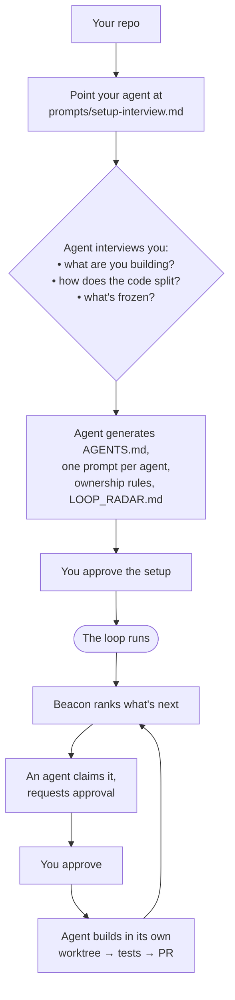

# Multi-Agent Loop Kit

**Stop prompting coding agents one task at a time. Give your repo a loop.**

Multi-Agent Loop Kit is a markdown + bash protocol that helps an AI agent turn
your existing repo into a supervised multi-agent coding loop.

It gives your repo:

- **Beacon** — a loop-planning agent that watches repo state and ranks what
  matters next
- **coding agents** — repo-specific agents with owned paths, prompts, journals,
  and worktrees
- **task briefs** — small, approval-gated units of work
- **approval gates** — the Project Lead approves before agents build
- **safe auto-mode** — approved agents keep working through numbered slices until
  a stop condition (see [`docs/AUTO_MODE.md`](docs/AUTO_MODE.md))
- **journals + PR discipline** — status, blockers, and decisions written down
  instead of lost in chat

It is **not** unattended autonomy. It is structured, human-approved auto-mode
for repos with clear specs and separable work.

```txt
Beacon watches the repo.
Coding agents listen.
You approve.
They build.
The loop continues.
```

```txt
Beacon sees what matters next
        ↓
agents claim owned work
        ↓
Project Lead approves
        ↓
agents build in worktrees
        ↓
tests + PR + journals
        ↓
Beacon learns and loops again
```

## Why loops, not prompts?

Most AI coding still works like this:

```txt
you prompt
agent works
agent stops
you inspect
you prompt again
agent forgets context
you re-explain
```

That does not scale when you are running multiple agents across a real repo.

This kit changes the unit of work from a prompt to a loop:

```txt
repo state → Beacon radar → task brief → approval → agent worktree → PR → journal → next loop
```

You still stay in control. You just stop babysitting every step.

> **Prompting is manual. Loops are operational.**

## Three modes

1. **Setup mode** — an agent reads your repo, interviews you, and proposes the
   multi-agent setup.
2. **Loop mode** — Beacon reads repo state, ranks next work, and creates task
   briefs.
3. **Safe auto-mode** — approved agents keep working through their owned,
   numbered slices until a stop condition.

Works with Cursor, Claude Code, Codex, Windsurf, or any AI coding tool that can
read repo files and follow prompts. No daemon. No runtime dependency. Markdown +
bash. MIT.

---

## How it works (the whole flow)



One non-coding agent (**Beacon**) ranks what matters next. Coding agents each own
a slice of the repo and build only what's approved. You (the **Project Lead**)
are the approval gate the whole way around.

For the full method see **[`OPERATING_GUIDE.md`](OPERATING_GUIDE.md)**; for the
concepts and rules see **[`PROTOCOL.md`](PROTOCOL.md)**.

---

## Where an agent starts

There is exactly one entry point. Hand your coding agent this:

```txt
Read prompts/setup-interview.md and follow it. Interview me, then propose the
setup. Don't start any agents or create worktrees until I approve.
```

That file tells the agent what the kit is, how to read your repo, what to ask
you, and what to generate — stopping for your approval before anything
irreversible. (Cursor / Claude Code / Codex read `AGENTS.md` automatically,
which points here too.) Per-tool prompts are in
[`docs/INSTALL_WITH_YOUR_AGENT.md`](docs/INSTALL_WITH_YOUR_AGENT.md).

---

## What changes in your repo

The kit is additive. Your code, build, and CI are untouched; you gain a
coordination layer:

```txt
your-repo/
├── apps/ packages/ ...      # YOUR code — unchanged, now split into owned paths
├── AGENTS.md                # NEW · who owns which paths (the source of truth)
├── LOOP_RADAR.md            # NEW · ranked "what's next" (Beacon writes this)
├── LOOP_MEMORY.md           # NEW · durable decisions and lessons
├── prompts/                 # NEW · one prompt per agent + Beacon
├── agents-status/           # NEW · journals, approvals, proposals, task briefs
├── .cursor/rules/           # NEW · ownership + loop rules your tools read
└── tools/                   # NEW · status / standup / spawn scripts
```

After setup, each agent has a codename, an owned path, a prompt, a journal, and
its own git worktree. Nothing runs autonomously — you approve every build.

---

## Quickstart

### A. New / empty repo (recommended starting point)

Easiest way to learn the kit is on a fresh repo where nothing can conflict.

```bash
# Option 1: click "Use this template" on GitHub, then clone your new repo.
# Option 2: clone this kit directly:
git clone https://github.com/anshulixyz/multi-agent-loop-kit.git my-loop-repo
cd my-loop-repo
# optional: npx degit anshulixyz/multi-agent-loop-kit my-loop-repo  (history-free copy)
```

Then point your agent at `prompts/setup-interview.md` (see above) and follow the
interview.

### B. Existing repo

First clone the kit once, then run its safe installer against your project — it
never overwrites your files (collisions are saved as `<name>.loopkit` to merge,
and your `package.json` is left alone):

```bash
# 1. clone the kit somewhere (once)
git clone https://github.com/anshulixyz/multi-agent-loop-kit.git ~/multi-agent-loop-kit

# 2. install it into your project
bash ~/multi-agent-loop-kit/scripts/install-into-repo.sh /path/to/your-repo

# 3. go into your repo and run bootstrap
cd /path/to/your-repo
bash scripts/bootstrap.sh
```

Then point your agent at `prompts/setup-interview.md` to configure agents for
your repo. See **[Will it conflict with my repo?](#will-it-conflict-with-my-repo)** below.

---

## Running it & seeing status

Beacon is just an AI session with `prompts/beacon.md` loaded — you open it at
loop boundaries (session start, after merges, when an agent is blocked), not on a
timer. It ranks work into `LOOP_RADAR.md`; agents pick it up; you approve; they
build. One command shows you the whole board:

```bash
bun run status     # every agent: branch, last update (+ stale flag), now / blocked / next
bun run loop       # status board → scan → radar → standup, in one shot
```

Agents report by writing their journals (`agents-status/<codename>.md`), so you
never ask for a status — you read it. Full operator workflow, the Beacon cadence,
and every status command are in **[`OPERATING_GUIDE.md`](OPERATING_GUIDE.md)**.

---

## Prerequisites

### The one that actually matters: a real plan

This kit coordinates *execution*. It does **not** decide what to build. Before you
run a single agent, you need the project to be genuinely well-specified:

- **A project plan** — what you're building and the slices to get there.
- **A tech spec** — stack, data models/contracts, the APIs and modules each agent
  will own. Agents read this; it's what makes their work concrete instead of
  invented. (In practice each agent's prompt points at the relevant spec
  sections — see `examples/` and `prompts/coding-agent.md`.)
- **Clearly defined goals** — one concrete objective the loop optimizes toward.
- **Ideally: UI specs + a design system** — if there's a frontend, the agents
  building it need the screens, components, and tokens defined, or they'll each
  invent their own and you'll spend the loop reconciling.

This is for projects that are **clear to develop**. If the spec changes hourly or
the goals are fuzzy, the loop will amplify the confusion across N agents instead
of one. Plan first, loop second. The richer the spec, the more the agents can do
without re-prompting — which is the whole point. (Don't have a spec yet? See
[`docs/PREPARING_YOUR_SPEC.md`](docs/PREPARING_YOUR_SPEC.md) for what "ready"
looks like.)

### Tooling

- **git 2.7+** (the model uses `git worktree`)
- **bash** (macOS, Linux, or WSL/Git Bash)
- **An AI coding tool** that reads repo files and follows a prompt

Optional: a JS runtime (`bun`/`npm`) only for the `run` script shortcuts — they
just wrap `bash tools/...`, so you can run them directly; and `gh` to also list
PRs in standup.

---

## Do I even need this?

It pays off when work can be partitioned by path — multiple surfaces, clear
boundaries, enough work for 2–5 agents, and a human willing to review. It's
overhead when the repo is tiny, the work is one short fix, or ownership can't be
drawn. If your work is mostly cross-cutting, use fewer agents — or one — until it
isn't. (`PROTOCOL.md` has the full "when this fits" discussion.)

> This kit may work very well for your repo, or it may not. It works for my own
> AI/product projects because the work can be planned, partitioned, reviewed, and
> looped with human approval.

## When this works best

This works best when:

- the repo has a clear PRD, spec, or roadmap
- work can be split by path
- contracts or shared types are known
- agents can run tests before PR
- a human is willing to approve task briefs and review PRs

It works badly when:

- the product direction changes every hour
- every task touches the whole repo
- there are no tests or specs
- you want unattended autonomy

---

## Will it conflict with my repo?

Not if you use the installer (`scripts/install-into-repo.sh`) — it never
overwrites a file you already have. The only file most repos already own is
`AGENTS.md` (common for agent tooling); the installer keeps yours and writes
`AGENTS.md.loopkit` beside it to merge. Shared dirs (`.github/`, `.cursor/`,
`tools/`, `docs/`) are merged file-by-file, adding only what's new. The kit's
own reference docs (this README, `PROTOCOL.md`, examples, the snapshot) are
**not** copied into your repo — they live in the kit. So adoption is additive:
your README, build, license, and CI stay exactly as they are.

---

## What's in here

| Path | What it is |
|---|---|
| [`OPERATING_GUIDE.md`](OPERATING_GUIDE.md) | **The method** — step by step: break work into agents, write prompts, run the loop, check status |
| [`RUNBOOK.md`](RUNBOOK.md) | **When reality deviates** — a scenario playbook (contract gap, stuck agent, finished early, demo failure, …) as trigger → who decides → steps |
| [`PROTOCOL.md`](PROTOCOL.md) | The concepts and rules: pillars, loop, authority split, task-brief vs proposal, states |
| [`docs/PREPARING_YOUR_SPEC.md`](docs/PREPARING_YOUR_SPEC.md) | Is your project ready to loop? The plan/spec/design-system checklist to do **before** you start |
| [`docs/AUTO_MODE.md`](docs/AUTO_MODE.md) | What "safe auto-mode" lets an agent do, what it forbids, and the stop conditions |
| [`AGENTS.md`](AGENTS.md) | The ownership registry (you fill this in for your repo) |
| `prompts/` | `setup-interview.md` (start here), `beacon.md`, `coding-agent.md`, `operator.md` |
| `agents-status/` | Journal, approval, proposal, and task-brief templates |
| `tools/`, `scripts/` | Status/standup/spawn helpers and the safe installer |
| [`examples/`](examples/) | Worked repos — see below |
| `docs/` | Agent-install prompts, naming strategy, future integrations |

---

## Examples

The real value is seeing a repo structured for multiple agents. Two are included:

- [`examples/web-api-shared/`](examples/web-api-shared/) — a generic
  `web + api + shared-types` repo with 3 agents. Start here; it's the simplest
  honest shape.
- [`examples/intent-pad/`](examples/intent-pad/) — a richer 5-agent product, with
  a fully worked loop iteration ([`WALKTHROUGH.md`](examples/intent-pad/WALKTHROUGH.md))
  showing radar → task brief → approval → journal → memory, plus a worked
  proposal for the cross-cutting case.

---

## Contributing & license

See [`CONTRIBUTING.md`](CONTRIBUTING.md). MIT licensed. Issues with your repo
shape, agent count, tool, and OS are very welcome — that's how the kit gets more
portable.
